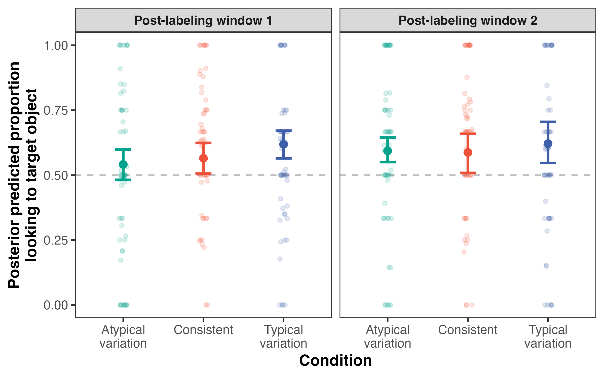
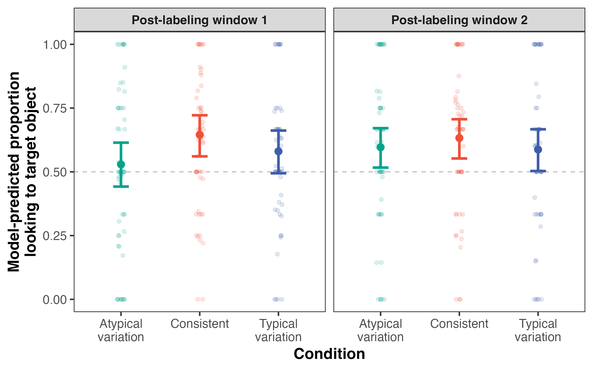
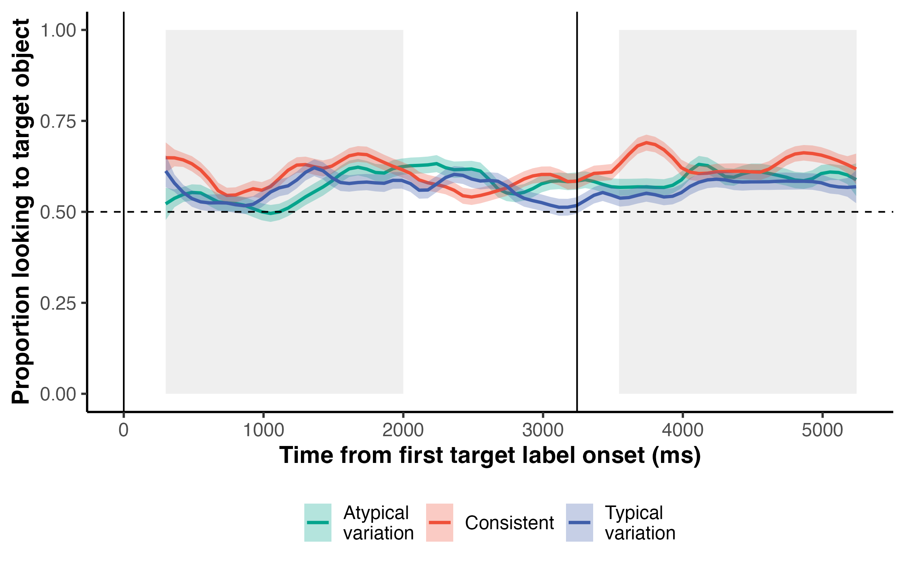
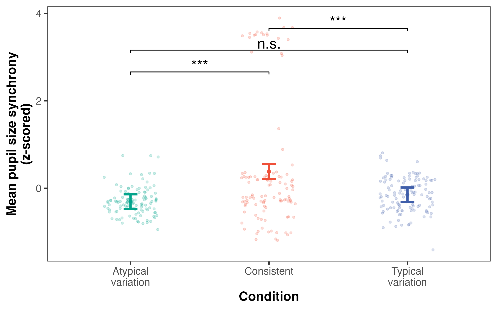
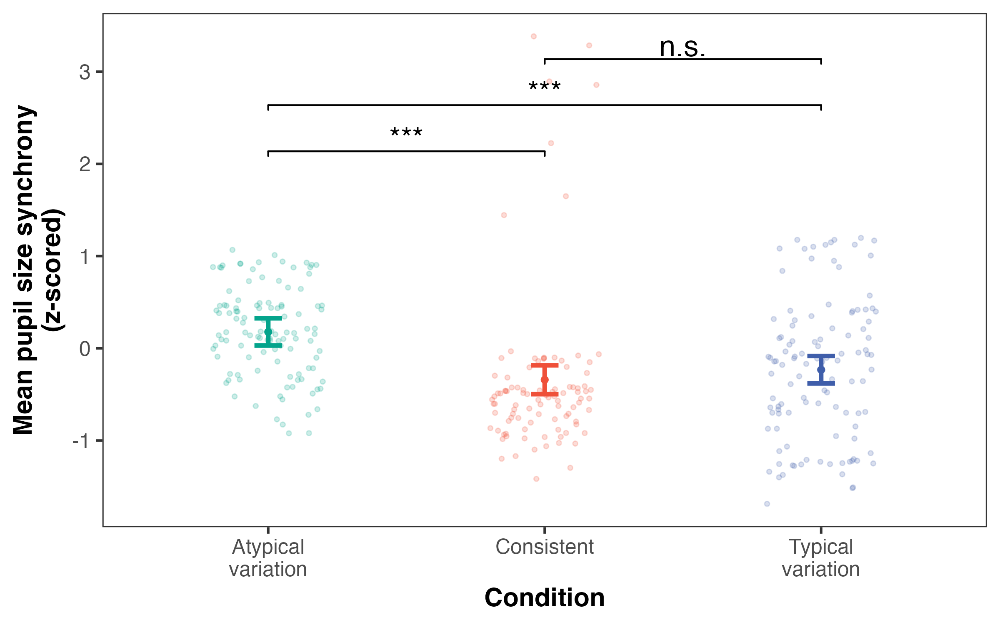

```{r setup}
library(tidyverse)
library(readxl)
library(tidybayes)
library(posterior)
library(flextable)
library(lme4)
library(lmerTest)
library(broom)
library(broom.mixed)
library(emmeans)
library(brms)
library(loo)
library(ggsignif)
library(papaja)

# set condition colors
condition.colors <- c("stable" = "#ef5039", 
                      "unnaturalv" = "#04a48c", 
                      "naturalv" = "#3f5eaa")


levels <- c("unnaturalv", "stable", "naturalv")

# create custom theme for consistent plotting
theme_custom <- function(base_size=15) {
  theme_test(base_size=base_size) +
    theme(
      legend.position="none",
      strip.text=element_text(face="bold"),
      axis.title=element_text(face="bold")
    )
}

# read in metadata
log <- read_xlsx("data/metadata/ANON-ptcp-log.xlsx")

final.sample <- filter(log, usable_checked == "y") 

ages <- final.sample %>%
  transmute(id=str_extract(ptcp_id, "[0-9][0-9][0-9]"), 
            age_c=datawizard::standardize(age))

# read in data
data <- read_csv("data/prepped-data.csv")
test.props <- read_csv("data/test-props.csv")
test.props.bywindow <- read_csv("data/test-props-bywindow.csv")
eyetrackingr.data <- read_csv("data/eyetrackingr-data.csv")

# re-run brms models? set to TRUE or FALSE
rerun = FALSE
```

# Re-analyzing LWL accuracy: Zero-one-inflated beta regression analyses
```{r test-bayes, results="hide"}
model.data <- test.props %>%
  mutate(id=str_extract(pid, "[0-9][0-9][0-9]")) %>%
  left_join(ages, by="id") %>%
  mutate(condition=relevel(as.factor(condition), ref="unnaturalv"))

model.data.bywindow <- test.props.bywindow %>%
  mutate(id=str_extract(pid, "[0-9][0-9][0-9]")) %>%
  left_join(ages, by="id") %>%
  mutate(condition=relevel(as.factor(condition), ref="unnaturalv"))

if (rerun) {
  m.age <- brm(
    bf(prop ~ condition + age_c + (1 + condition | id) + (1 + condition + age_c | base_word),
     phi ~ condition + age_c,
     zoi ~ condition + age_c,
     coi ~ condition + age_c),
  data=model.data,
  family=zero_one_inflated_beta(),
  chains=4,
  cores=4,
  save_pars=save_pars(all=TRUE),
  iter=2000,
  warmup=1000,
  seed=20250803,
  control=list(adapt_delta=0.999)
  )
  saveRDS(m.age, file="models/m-age.rds")
  
  m.age.int <- brm(
  bf(prop ~ condition * age_c + (1 + condition | id) + (1 + condition * age_c | base_word),
     phi ~ condition * age_c,
     zoi ~ condition * age_c,
     coi ~ condition * age_c),
  data=model.data,
  family=zero_one_inflated_beta(),
  chains=4,
  cores=4,
  save_pars=save_pars(all=TRUE),
  iter=2000,
  warmup=1000,
  seed=20250803,
  control=list(adapt_delta=0.999)
  )
  saveRDS(m.age.int, file="models/m-age-int.rds")
  
  m.window <- brm(
  bf(prop ~ condition * window + age_c + (1 + condition * window | id) + (1 + condition * window + age_c | base_word),
     phi ~ condition * window + age_c,
     zoi ~ condition * window + age_c,
     coi ~ condition * window + age_c),
  data=model.data.bywindow,
  family=zero_one_inflated_beta(),
  chains=4,
  cores=4,
  iter=4000,
  warmup=2000,
  seed=20250803,
  control=list(adapt_delta=0.999)
)
  saveRDS(m.window, file="models/m-window.rds")

  
  m.window1 <- brm(
  bf(prop ~ condition + age_c + (1 + condition | id) + (1 + condition + age_c | base_word),
     phi ~ condition + age_c,
     zoi ~ condition + age_c,
     coi ~ condition + age_c),
  data=filter(model.data.bywindow, window == "first"),
  family=zero_one_inflated_beta(),
  chains=4,
  cores=4,
  iter=2000,
  warmup=1000,
  seed=20250803,
  control=list(adapt_delta=0.999)
)
  saveRDS(m.window1, file="models/m-window1.rds")

  m.window2 <- brm(
  bf(prop ~ condition + age_c + (1 + condition | id) + (1 + condition + age_c | base_word),
     phi ~ condition + age_c,
     zoi ~ condition + age_c,
     coi ~ condition + age_c),
  data=filter(model.data.bywindow, window == "second"),
  family=zero_one_inflated_beta(),
  chains=4,
  cores=4,
  iter=2000,
  warmup=1000,
  seed=20250803,
  control=list(adapt_delta=0.999)
)
  saveRDS(m.window2, file="models/m-window2.rds")
  
  # compare models (pre-registered plan)
  loo1 <- loo(m.age, moment_match=TRUE, reloo=TRUE)
  loo2 <- loo(m.age.int, moment_match=TRUE, reloo=TRUE)
  comp <- loo_compare(loo1, loo2) %>%
    as_tibble() %>%
    tibble::rownames_to_column(var="model") %>%
    write_csv("models/compare.csv")
} else {
  m.age <- readRDS("models/m-age.rds")
  m.age.int <- readRDS("models/m-age-int.rds")
  m.window1 <- readRDS("models/m-window1.rds")
  m.window2 <- readRDS("models/m-window2.rds")
  comp <- read_csv("models/compare.csv")
}

first.window <- 300:2000
second.window <- (mean(data$second_label) - 
                    mean(data$first_label) + 300):(mean(data$second_label) - 
                                                        mean(data$first_label)+2000)

library(tidybayes)
# summarize posterior
m.age_summary <- as_draws_df(m.age) %>%
    pivot_longer(cols=starts_with("b_"), 
                 names_to="parameter", 
                 values_to="value") %>%
  group_by(parameter) %>%
  mean_qi(.width=0.89) %>%
  select(parameter, starts_with("value"))

m.window1_summary <- as_draws_df(m.window1) %>%
    pivot_longer(cols=starts_with("b_"), 
                 names_to="parameter", 
                 values_to="value") %>%
  group_by(parameter) %>%
  mean_qi(.width=0.89) %>%
  select(parameter, starts_with("value"))

m.window2_summary <- as_draws_df(m.window2) %>%
    pivot_longer(cols=starts_with("b_"), 
                 names_to="parameter", 
                 values_to="value") %>%
  group_by(parameter) %>%
  mean_qi(.width=0.89) %>%
  select(parameter, starts_with("value"))
```
```{r posterior-predictions}
# generate posterior predictions per condition
newdata <- data.frame(
  condition=factor(c("unnaturalv", "stable", "naturalv"), levels=levels(model.data$condition)), 
  age_c=0
)

# get fitted estimates of the mean (mu parameter of the beta)
preds <- posterior_epred(m.age, newdata=newdata, re_formula=NA)
preds_window1 <- posterior_epred(m.window1, newdata=newdata, re_formula=NA)
preds_window2 <- posterior_epred(m.window2, newdata=newdata, re_formula=NA)

# calculate means and 89% credible intervals
pred_summary <- as.data.frame(preds) %>%
  setNames(levels(newdata$condition)) %>%
  pivot_longer(everything(), names_to="condition", values_to="mu") %>%
  group_by(condition) %>%
  summarize(
    mean=mean(mu),
    ci_lower=quantile(mu, probs=0.055, names=FALSE),
    ci_upper=quantile(mu, probs=0.945, names=FALSE)
  )

pred_summary1 <- as.data.frame(preds_window1) %>%
  setNames(levels(newdata$condition)) %>%
  pivot_longer(everything(), names_to="condition", values_to="mu") %>%
  group_by(condition) %>%
  summarize(
    mean=mean(mu),
    ci_lower=quantile(mu, 0.055),
    ci_upper=quantile(mu, 0.945)
  )

pred_summary2 <- as.data.frame(preds_window2) %>%
  setNames(levels(newdata$condition)) %>%
  pivot_longer(everything(), names_to="condition", values_to="mu") %>%
  group_by(condition) %>%
  summarize(
    mean=mean(mu),
    ci_lower=quantile(mu, 0.055),
    ci_upper=quantile(mu, 0.945)
  )

draws <- as_draws_df(m.age)
summary <- summarize_draws(draws)
```
Our primary analysis examined whether children successfully learned novel word--object mappings across conditions. Using the `brms` package [@brms], we fit mixed-effects zero-one-inflated beta regression models to examine the effects of condition and age on children's novel word-recognition accuracy (i.e., proportion looking to the target object). Beta regression was chosen to model the proportional dependent variable [@cribari2010beta]. Specifically, we used zero-one-inflated models since 0s and 1s were common values in our data [@liu2018review]. Note that this particular modeling approach requires a Bayesian framework to interpret. Importantly, this analytic approach allows us to quantify evidence in support of the null hypothesis, not simply against it. Models included fixed effects for condition (atypical variation vs. consistent vs. typical variation) and mean-centered age, along with the maximal random effects structure (by-participant and by-item random slopes and intercepts). Following our pre-registered analyses reported in the main text, we tested whether including an interaction between condition and age improved model fit---we compared the model with the interaction term to the simpler additive model using approximate leave-one-out cross-validation [LOO, @loo]. This analysis suggested no reliable difference in predictive accuracy, providing no strong evidence that the interaction term improved model fit (ΔELPD=`r format(round(filter(comp, model == 2)$elpd_diff, 2), nsmall=2)`, ΔSE=`r format(round(filter(comp, model == 2)$se_diff, 2), nsmall=2)`). We used weakly informative priors (standard normal distributions) and fitted the model using Hamiltonian Monte Carlo sampling (four chains, four cores) implemented in Stan [@rstan]. All $\hat{R}$ values were 1.00, indicating good convergence. Effective sample sizes (Bulk ESS: `r round(min(summary$ess_bulk, na.rm=TRUE), 0)`--`r format(round(max(summary$ess_bulk, na.rm=TRUE), 0), big.mark=",")`; Tail ESS: `r round(min(summary$ess_tail, na.rm=TRUE), 0)`--`r format(round(max(summary$ess_tail, na.rm=TRUE), 0), big.mark=",")`) were sufficiently large, indicating stable and reliable posterior estimates.

Results revealed that children's performance was reliably above chance overall as well as in both critical windows across all conditions, except for the first critical window---the primary target of analysis in the vast majority of LWL studies [e.g., @fernald2008looking]---for the atypical variation condition, where children's looking behavior was at chance level (*M*=`r format(round(filter(pred_summary1, condition == "unnaturalv")$mean, 2))`, 89% CrI \[`r format(round(filter(pred_summary1, condition == "unnaturalv")$ci_lower, 2))`, `r format(round(filter(pred_summary1, condition == "unnaturalv")$ci_upper, 2), nsmall=2)`\]). This result replicates the key findings reported in the main text.

Across both critical windows, model-predicted accuracy was highest in the typical variation condition (*M*=`r format(round(filter(pred_summary, condition == "naturalv")$mean, 2))`, 89% CrI \[`r format(round(filter(pred_summary, condition == "naturalv")$ci_lower, 2))`, `r format(round(filter(pred_summary, condition == "naturalv")$ci_upper, 2))`\]), followed by the consistent condition (*M*=`r format(round(filter(pred_summary, condition == "stable")$mean, 2))`, 89% CrI \[`r format(round(filter(pred_summary, condition == "stable")$ci_lower, 2))`, `r format(round(filter(pred_summary, condition == "stable")$ci_upper, 2))`\]), and lowest in the atypical variation condition (*M*=`r format(round(filter(pred_summary, condition == "unnaturalv")$mean, 2))`, 89% CrI \[`r format(round(filter(pred_summary, condition == "unnaturalv")$ci_lower, 2))`, `r format(round(filter(pred_summary, condition == "unnaturalv")$ci_upper, 2))`\]). The relative order of performance across conditions varies compared to the results reported in the main text, in part because `brms` allows for model convergence with the maximal random effects structure. **Figure S1** shows model-predicted accuracy across conditions for the two critical windows. **Table S1** shows all model parameter estimates for fixed effects, and below, we break down the key results that are of theoretical interest.

```{r fig1, fig.cap="Figure S1. Posterior predicted accuracy by condition across both post-labeling time windows. Point ranges reflect posterior means with 89% credible intervals. Jittered dots show raw means for individual participants. Dotted line at 0.50 indicates chance looking.", fig.width=8, fig.height=5}

raw_summary <- model.data.bywindow %>%
  mutate(condition=factor(condition, levels=c("unnaturalv", "stable", "naturalv"))) %>%
  group_by(pid, condition, window) %>%
  summarize(prop=mean(prop)) %>%
  ungroup() %>%
  mutate(model=ifelse(window == "first", "Post-labeling window 1", "Post-labeling window 2"))

pred_summary1 <- pred_summary1 %>%
  mutate(model="Post-labeling window 1")

pred_summary2 <- pred_summary2 %>%
  mutate(model="Post-labeling window 2")

pred_all <- bind_rows(pred_summary1, pred_summary2) %>%
  mutate(
    model=factor(model, levels=c("Post-labeling window 1", "Post-labeling window 2")),
    condition=factor(condition, levels=c("unnaturalv", "stable", "naturalv"))
  )

fig1 <- ggplot(pred_all, aes(x=condition, y=mean, ymin=ci_lower, ymax=ci_upper, color=condition)) +
  geom_hline(yintercept=0.5, linetype="dashed", color="gray") + 
    geom_jitter(data=raw_summary, 
                mapping=aes(x=condition, 
                              y=prop, 
                              color=condition), 
              inherit.aes=FALSE, alpha=0.15,  width=0.05, size=1.5) + 
  geom_point(size=3, position=position_dodge(width=0.5)) +
  geom_errorbar(width=0.2, size=1.2, position=position_dodge(width=0.5)) +
  facet_wrap(~model) +
  scale_color_manual(values=condition.colors) +
  scale_x_discrete(labels=c("Atypical\nvariation", 
                              "Consistent", 
                              "Typical\nvariation")) + 
  labs(
    x="Condition",
    y="Posterior predicted proportion\nlooking to target object",
    color="Condition"
  ) +
  theme_custom()
ggsave("FigureS1.png", fig1, width=8, height=5, dpi=300)

```

The beta ($\mu$) component of the model, which estimates effects on the mean outcome for non-boundary values (i.e., proportions between but not including 0 or 1), showed positive effects for both the typical variation condition (*β*=`r format(round(filter(m.age_summary, parameter == "b_conditionnaturalv")$value, 2), nsmall=2)`, 89% CrI: \[`r format(round(filter(m.age_summary, parameter == "b_conditionnaturalv")$value.lower, 2), nsmall=2)`, `r format(round(filter(m.age_summary, parameter == "b_conditionnaturalv")$value.upper, 2), nsmall=2)`\]) and the consistent condition (*β*=`r format(round(filter(m.age_summary, parameter == "b_conditionstable")$value, 2), nsmall=2)`, 89% CrI: \[`r format(round(filter(m.age_summary, parameter == "b_conditionstable")$value.lower, 2), nsmall=2)`, `r format(round(filter(m.age_summary, parameter == "b_conditionstable")$value.upper, 2), nsmall=2)`\]), relative to the atypical variation condition. Although the credible intervals include zero, the direction and magnitude of these effects suggest a possible learning advantage for both typical variation and consistency over atypical variation. The effect of mean-centered age was negligible (*β*=`r format(round(filter(m.age_summary, parameter == "b_age_c")$value, 2), nsmall=2)`, 89% CrI: \[`r format(round(filter(m.age_summary, parameter == "b_age_c")$value.lower, 2), nsmall=2)`, `r format(round(filter(m.age_summary, parameter == "b_age_c")$value.upper, 2), nsmall=2)`\]).

The conditional one-inflation (coi) component, which estimates, among boundary values, the probability of being 1 (vs. 0), also showed similar trends for the effect of condition. Participants were more likely to respond at ceiling for both the typical variation condition (*β*=`r format(round(filter(m.age_summary, parameter == "b_coi_conditionnaturalv")$value, 2), nsmall=2)`, 89% CrI: \[`r format(round(filter(m.age_summary, parameter == "b_coi_conditionnaturalv")$value.lower, 2), nsmall=2)`, `r format(round(filter(m.age_summary, parameter == "b_coi_conditionnaturalv")$value.upper, 2), nsmall=2)`\]) and consistent condition (*β*=`r format(round(filter(m.age_summary, parameter == "b_coi_conditionstable")$value, 2), nsmall=2)`, 89% CrI: \[`r format(round(filter(m.age_summary, parameter == "b_coi_conditionstable")$value.lower, 2), nsmall=2)`, `r format(round(filter(m.age_summary, parameter == "b_coi_conditionstable")$value.upper, 2), nsmall=2)`\]), relative to the atypical variation condition. While these condition effects remain uncertain given the credible interval overlap with zero, their alignment with estimates from the $\mu$ component suggests additional evidence for an advantage of both typical variation and consistency over atypical variation. The effect of age was clearly positive (*β*=`r format(round(filter(m.age_summary, parameter == "b_coi_age_c")$value, 2), nsmall=2)`, 89% CrI: \[`r format(round(filter(m.age_summary, parameter == "b_coi_age_c")$value.lower, 2), nsmall=2)`, `r format(round(filter(m.age_summary, parameter == "b_coi_age_c")$value.upper, 2), nsmall=2)`\]), indicating that older children were more likely to demonstrate 100% looking to the target object during the critical analysis windows.

```{r main-effects-table-prep}
format_est <- function(df, param) {
  row <- filter(df, parameter == param)
  sprintf("%.2f [%.2f, %.2f]", row$value, row$value.lower, row$value.upper)
}
params <- tribble(
  ~Effect, ~Param,
  "μ: condition (typical variation)", "b_conditionnaturalv",
  "μ: condition (consistent)", "b_conditionstable",
  "μ: age", "b_age_c",
  "zoi: condition (typical variation)", "b_zoi_conditionnaturalv",
  "zoi: condition (consistent)", "b_zoi_conditionstable",
  "zoi: age", "b_zoi_age_c",
  "coi: condition (typical variation)", "b_coi_conditionnaturalv",
  "coi: condition (consistent)", "b_coi_conditionstable",
  "coi: age", "b_coi_age_c"
)

summary_table <- params %>%
  mutate(
    `Overall`=map_chr(Param, ~ format_est(m.age_summary, .x)),
    `Window 1`=map_chr(Param, ~ format_est(m.window1_summary, .x)),
    `Window 2`=map_chr(Param, ~ format_est(m.window2_summary, .x))
  ) %>%
  select(-Param)
```

```{r table-main-effects}
#| tbl-cap: "Table S1. Posterior means and 89% credible intervals for each effect across models."
apa_table(
  summary_table,
  note="The overall model includes both post-labeling windows (averaged accuracy) and the window-specific models include proportion estimates for 300--2,000ms following each target word onset. The μ component models the predicted accuracy (i.e., proportion looking to the target object) for non-boundary values (values between but not including 0 or 1). The zoi (zero-one inflation) component models the likelihood of accuracy being a boundary value---floor (0) or ceiling (1). The coi (conditional-one inflation) component models the probability of ceiling responses (1s) among boundary values."
)
```
```{r test-bayes-reporting}
library(tidybayes)
library(posterior)
draws <- as_draws_df(m.age)
summary <- summarize_draws(draws)
```

```{r extract-summary, echo=FALSE, execute = FALSE}
library(brms)
library(dplyr)
library(tibble)

# Extract posterior summaries
post_sum <- posterior_summary(m.window1, prob = 0.89)

# Pull out fixed effects
natv_est <- post_sum["b_conditionnaturalv", "Estimate"]
natv_sd <- post_sum["b_conditionnaturalv", "Est.Error"]
natv_lb <- natv_est - qnorm(0.945) * natv_sd
natv_ub <- natv_est + qnorm(0.945) * natv_sd

stable_est <- post_sum["b_conditionstable", "Estimate"]
stable_sd <- post_sum["b_conditionstable", "Est.Error"]
stable_lb <- stable_est - qnorm(0.945) * stable_sd
stable_ub <- stable_est + qnorm(0.945) * stable_sd

age_est <- post_sum["b_age_c", "Estimate"]
age_sd <- post_sum["b_age_c", "Est.Error"]
age_lb <- age_est - qnorm(0.945) * age_sd
age_ub <- age_est + qnorm(0.945) * age_sd

# Posterior probabilities
draws <- as_draws_df(m.window1)
prob_natv <- mean(draws$b_conditionnaturalv > 0)
prob_stable <- mean(draws$b_conditionstable > 0)
prob_age <- mean(draws$b_age_c > 0)
```
Condition effects were weakly positive but uncertain. For the typical variation condition, the estimated effect was `r round(natv_est, 3)`, SD = `r round(natv_sd, 3)`, with a 89% credible interval from `r round(natv_lb, 3)` to `r round(natv_ub, 3)`. For the consistent condition, the estimate was `r round(stable_est, 3)`, SD = `r round(stable_sd, 3)`, 89% CI [`r round(stable_lb, 3)`, `r round(stable_ub, 3)`]. The effect of age was small (`r round(age_est, 3)`, SD = `r round(age_sd, 3)`), 89% CI [`r round(age_lb, 3)`, `r round(age_ub, 3)`].

Posterior probabilities that each effect was greater than zero were: `r round(prob_natv, 2)` for the effect of the typical variation condition (relative to atypical variation condition), `r round(prob_stable, 2)` for the effect of the consistent condition (relative to the atypical variation condition), and `r round(prob_age, 2)` for the effect of age. These results suggest limited evidence that either input condition or age significantly affected performance, though the posterior distributions for all three predictors leaned slightly positive.

# LWL window effects
## Zero-one-inflated beta regression analyses
We fit separate models for each post-labeling window. In the early time window (following the first label), there were no strong condition effects. The posterior estimate for the typical variation condition relative to atypical variation was *β* = `r format(round(filter(m.window1_summary, parameter == "b_conditionnaturalv")$value, 2), nsmall = 2)` (89% CrI: \[`r format(round(filter(m.window1_summary, parameter == "b_conditionnaturalv")$value.lower, 2), nsmall = 2)`, `r format(round(filter(m.window1_summary, parameter == "b_conditionnaturalv")$value.upper, 2), nsmall = 2)`\]). Similarly, the consistent condition estimate was *β* = `r format(round(filter(m.window1_summary, parameter == "b_conditionstable")$value, 2), nsmall = 2)` (89% CrI: \[`r format(round(filter(m.window1_summary, parameter == "b_conditionstable")$value.lower, 2), nsmall = 2)`, `r format(round(filter(m.window1_summary, parameter == "b_conditionstable")$value.upper, 2), nsmall = 2)`\]). These effects were small, and their credible intervals included zero.

In the later window (following the second label), condition effects were also relatively weak. The estimate for the typical variation condition relative to atypical variation was *β* = `r format(round(filter(m.window2_summary, parameter == "b_conditionnaturalv")$value, 2), nsmall = 2)` (89% CrI: \[`r format(round(filter(m.window2_summary, parameter == "b_conditionnaturalv")$value.lower, 2), nsmall = 2)`, `r format(round(filter(m.window2_summary, parameter == "b_conditionnaturalv")$value.upper, 2), nsmall = 2)`\]), and for the consistent condition: *β* = `r format(round(filter(m.window2_summary, parameter == "b_conditionstable")$value, 2), nsmall = 2)` (89% CrI: \[`r format(round(filter(m.window2_summary, parameter == "b_conditionstable")$value.lower, 2), nsmall = 2)`, `r format(round(filter(m.window2_summary, parameter == "b_conditionstable")$value.upper, 2), nsmall = 2)`\]).

## Linear mixed-effects regression analyses
```{r glmer-window}
# prep data
test.props <- read_csv("data/test-props.csv")
test.props.bywindow <- read_csv("data/test-props-bywindow.csv")

model.data <- test.props %>%
  mutate(id=str_extract(pid, "[0-9][0-9][0-9]")) %>%
  left_join(ages, by="id") %>%
  mutate(condition=relevel(as.factor(condition), ref="unnaturalv"))

model.data.bywindow <- test.props.bywindow %>%
  mutate(id=str_extract(pid, "[0-9][0-9][0-9]")) %>%
  left_join(ages, by="id") %>%
  mutate(condition=relevel(as.factor(condition), ref="unnaturalv"))


# explore window effects 
## simplify models to deal with non-convergence
m.window <- glmer(prop ~ condition + window + age_c + (1 | id), 
               data = model.data.bywindow, 
               family = binomial)

m.window.int <- glmer(prop ~ condition * window + age_c + (1 | id), 
               data = model.data.bywindow, 
               family = binomial)

m.window.comp <- anova(m.window, m.window.int) %>%
  tidy() %>%
  filter(term == "m.window.int")

pred.window <- emmeans(m.window, ~ condition, 
                    at = list(age_c = 0), type = "response") %>%
  as_tibble()

m.window.summary <- m.window %>%
  tidy() %>%
  filter(effect == "fixed", term != "(Intercept)") %>%
  mutate(or = round(estimate, 2), 
         se = round(std.error, 2), 
         p = round(p.value, 3))

m.window1 <- glmer(prop ~ condition + age_c + (1 | id), 
                   data = filter(model.data.bywindow, window == "first"), 
                   family = binomial)

pred.window1 <- emmeans(m.window1, ~ condition, 
                    at = list(age_c = 0), type = "response") %>%
  as_tibble()

m.window1.summary <- m.window1 %>%
  tidy() %>%
  filter(effect == "fixed", term != "(Intercept)") %>%
  mutate(or = round(estimate, 2), 
         se = round(std.error, 2), 
         p = round(p.value, 3))

m.window2 <- glm(prop ~ condition + age_c, 
                   data = filter(model.data.bywindow, window == "second"), 
                   family = binomial)

pred.window2 <- emmeans(m.window2, ~ condition, 
                    at = list(age_c = 0), type = "response") %>%
  as_tibble()

m.window2.summary <- m.window2 %>%
  tidy() %>%
  filter(term != "(Intercept)") %>%
  mutate(or = round(estimate, 2), 
         se = round(std.error, 2), 
         p = round(p.value, 3))
```
In the main text, we reported effects from mixed-effects logistic regression models [@lme4] predicting the average proportion of target looking across the two post-labeling windows (following our pre-registration). Adding post-labeling window to the base model[^1] revealed no effect of window (*β* = `r format(round(filter(m.window.summary, term == "windowsecond")$or, 2), nsmall = 2)`, *SE* = `r format(filter(m.window.summary, term == "windowsecond")$se, nsmall = 2)`, *p* = `r format(filter(m.window.summary, term == "windowsecond")$p, nsmall = 3)`). In addition, adding an interaction between window and condition did not significantly improve the model fit ($\chi^2$(`r m.window.comp$df`) = `r round(m.window.comp$statistic, 2)`, *p* = `r round(m.window.comp$p.value, 3)`). **Figure S2** shows model-predicted accuracy across conditions, separately for the two post-labeling windows.

```{r fig2, fig.cap="Figure S2. Model-predicted accuracy by condition across both post-labeling windows. Point ranges reflect estimated marginal means with 95% confidence intervals. Jittered dots show raw means for individual participants. The dashed line at 0.50 indicates chance performance.", fig.width=8, fig.height=5}

raw_summary <- model.data.bywindow %>%
  mutate(condition=factor(condition, levels=c("unnaturalv", "stable", "naturalv"))) %>%
  group_by(pid, condition, window) %>%
  summarize(prop=mean(prop)) %>%
  ungroup() %>%
  mutate(model=ifelse(window == "first", "Post-labeling window 1", "Post-labeling window 2"))

pred_summary1 <- pred.window1  %>%
  mutate(model="Post-labeling window 1") %>%
  rename(mean = prob,
         ci_lower = asymp.LCL, 
         ci_upper = asymp.UCL)

pred_summary2 <- pred.window2  %>%
  mutate(model="Post-labeling window 2") %>%
  rename(mean = prob,
         ci_lower = asymp.LCL, 
         ci_upper = asymp.UCL)

pred_all <- bind_rows(pred_summary1, pred_summary2) %>%
  mutate(
    model=factor(model, levels=c("Post-labeling window 1", "Post-labeling window 2")),
    condition=factor(condition, levels=c("unnaturalv", "stable", "naturalv"))
  )

fig2 <- ggplot(pred_all, aes(x=condition, y=mean, ymin=ci_lower, ymax=ci_upper, color=condition)) +
  geom_hline(yintercept=0.5, linetype="dashed", color="gray") + 
    geom_jitter(data=raw_summary, 
                mapping=aes(x=condition, 
                              y=prop, 
                              color=condition), 
              inherit.aes=FALSE, alpha=0.15,  width=0.05, size=1.5) + 
  geom_point(size=3, position=position_dodge(width=0.5)) +
  geom_errorbar(width=0.2, size=1.2, position=position_dodge(width=0.5)) +
  facet_wrap(~model) +
  scale_color_manual(values=condition.colors) +
  scale_x_discrete(labels=c("Atypical\nvariation", 
                              "Consistent", 
                              "Typical\nvariation")) + 
  labs(
    x="Condition",
    y="Model-predicted proportion\nlooking to target object",
    color="Condition"
  ) +
  theme_custom()
ggsave("FigureS2.png", fig2, width=8, height=5, dpi=300)

```
[^1]: glmer(prop. target looking ~ condition + window + age + (1 | id), family = binomial)
  
## Cluster-based permutation analyses
```{r cluster-based-permutation, execute = FALSE}
rerun.cbp = FALSE

if (rerun.cbp) {
library(foreach)
library(doSNOW)
library(parallel)
library(data.table)

# ==== CONFIG ====
n_perm <- 1000  # number of permutations
f_threshold <- qf(0.80, df1 = 2, df2 = 92)
time_var <- "time_bin"

# ==== Define helper functions ====

# Repeated-measures ANOVA F-value (using base R aov)
get_f_stat <- function(df) {
  tryCatch({
    out <- summary(aov(accuracy ~ condition + Error(pid / condition), data = df))
    out[[2]][[1]]["F value"][1]
  }, error = function(e) NA_real_)
}

# Identify largest cluster (sum of F-values over consecutive bins above threshold)
get_max_cluster_anova <- function(df, threshold = f_threshold) {
  df <- df %>%
    mutate(sig = ifelse(F_val >= threshold, "sig", "ns"),
           cluster = data.table::rleid(sig)) %>%
    filter(sig == "sig") %>%
    group_by(cluster) %>%
    summarise(start = min(!!sym(time_var)),
              stop = max(!!sym(time_var)) + 50,
              auc = sum(F_val), .groups = "drop")
  
  if (nrow(df) == 0) return(tibble(cluster = 0, start = 0, stop = 0, auc = 0))
  
  df[which.max(df$auc), ]
}

# Shuffle condition labels within each participant
permute_within_subjects <- function(data, seed) {
  set.seed(seed)
  data %>%
    group_by(pid, !!sym(time_var)) %>%
    mutate(condition = sample(condition)) %>%
    ungroup()
}

# ==== Set up parallel backend ====
n_cores <- detectCores() - 1
cl <- makeCluster(n_cores)
registerDoSNOW(cl)

pb <- txtProgressBar(max = n_perm, style = 3)
progress <- function(n) setTxtProgressBar(pb, n)
opts <- list(progress = progress)

# ==== Prepare data ====
dc = eyetrackingr.data %>%
  filter(time >= 300 & time <= max(second.window)) %>%
  mutate(accuracy = ifelse(fix == "target", 1, 0))

dc_binned <- dc %>%
  mutate(time_bin = floor(time / 50) * 50) %>%
  group_by(pid, condition, time_bin) %>%
  summarise(accuracy = mean(accuracy, na.rm = TRUE), .groups = "drop") %>%
  group_by(pid, time_bin) %>%
  filter(length(unique(condition)) == 3) %>%
  ungroup()

# ==== Run observed F-stats and max cluster ====
f_obs <- dc_binned %>%
  group_by(!!sym(time_var)) %>%
  group_modify(~ tibble(F_val = get_f_stat(.x))) %>%
  ungroup()

max_cluster_obs <- get_max_cluster_anova(f_obs)

# ==== Run permutations in parallel ====
perm_cluster_aucs <- foreach(i = 1:n_perm, .combine = c,
                             .options.snow = opts,
                             .packages = c("tidyverse", "data.table")) %dopar% {
  d_perm <- permute_within_subjects(dc_binned, seed = i)

  f_perm <- d_perm %>%
    group_by(!!sym(time_var)) %>%
    group_modify(~ tibble(F_val = get_f_stat(.x))) %>%
    ungroup()

  get_max_cluster_anova(f_perm)$auc
}

stopCluster(cl)

# ==== Compute p-value and plot ====
p_obs <- mean(perm_cluster_aucs > max_cluster_obs$auc)

# ggplot() +
#   geom_density(aes(x = perm_cluster_aucs), fill = "gray", alpha = 0.5) +
#   geom_vline(xintercept = max_cluster_obs$auc, color = "blue", linewidth = 1.2) +
#   labs(title = "Permutation-based Null Distribution (3-level ANOVA)",
#        subtitle = paste("Observed p =", round(p_obs, 3)),
#        x = "Max cluster AUC (F values)")
} else {
  max_cluster_obs <- tibble(
    cluster = 3, 
    start = 350,
    stop = 400, 
    auc = 2.92
  )
  p_obs <- 0.997
}
```

A cluster-based permutation test [@maris2007nonparametric] identified a marginal cluster from `r max_cluster_obs$start` to `r max_cluster_obs$stop`ms (AUC = `r max_cluster_obs$auc`), but this cluster did not reach significance compared to the permutation-based null distribution (p = `r p_obs`), suggesting at most a weak and transient effect of condition. **Figure S3** shows the full timecourse of participants' looks to the target object during test trials.

```{r fig3}
#| label: fig3
#| fig-cap: "Figure S3: Timecourse of participants' looks during test trials with shaded standard error regions. The black dashed line at 0.50 represents chance looking. The gray shaded regions indicate the critical analysis windows (300-2000ms) following target word onset."

library(eyetrackingR)
eyetrackingr.data <- eyetrackingr.data %>%
  mutate(trackloss = NA, 
         aoi = ifelse(target == 1, "target", "distracter"),
         target = ifelse(target == 1, TRUE, FALSE),
         distracter = ifelse(distracter, TRUE, FALSE)) %>% 
  distinct() 

et_data <- eyetrackingr.data %>%
  group_by(pid, trial, time) %>%
  filter(n() == 1) %>%
  make_eyetrackingr_data(., 
                         participant_column = "pid",
                         trial_column = "trial",
                         time_column = "time",
                         trackloss_column = "trackloss",
                         aoi_columns = c("target", "distracter"),
                         treat_non_aoi_looks_as_missing = TRUE)

max.time <- data %>%
  summarize(max = mean(second_label) - mean(first_label) + 2000) %>%
  pull(max)

response_window <- subset_by_window(et_data,
                                     window_start_time = min(first.window),
                                     window_end_time = max(second.window), 
                                     rezero = FALSE)

response_window2 <- subset_by_window(et_data,
                                     window_start_time = min(second.window),
                                     window_end_time = max(second.window), 
                                     rezero = FALSE)

response_window1 <- subset_by_window(et_data,
                                     window_start_time = 300,
                                     window_end_time = 2000, 
                                     rezero = FALSE)

response_window_agg_by_sub <- make_time_window_data(response_window1, 
                                                    aois='target',
                                              predictor_columns=c('condition'),
                                                    summarize_by = "pid") %>%
  mutate(condition = factor(condition, levels = c("unnaturalv", "naturalv", "stable")), 
         id = str_extract(pid, "[0-9][0-9][0-9]")) %>%
  left_join(ages, by = "id")

response_time <- make_time_sequence_data(response_window,
                                         time_bin_size = 10, 
                                         predictor_columns = c("condition"),
                                         aois = "target",
                                         summarize_by = "pid")

response_time <- response_time %>%
  mutate(condition = factor(condition, levels = c("unnaturalv", "stable", "naturalv")))

fig3 <- response_time %>%
  ggplot(aes(x = Time, y = Prop, color = condition)) +
  geom_ribbon(aes(xmin = 300, xmax = 2000), color = NA, fill = "gray", alpha = 0.25) + 
  geom_ribbon(aes(xmin = min(second.window), xmax = max(second.window)), 
             color = NA, fill = "gray", alpha = 0.25) + 
  stat_smooth(method="loess", span=0.1, se=TRUE, aes(fill=condition), alpha=0.3) +
  labs(x = "Time from first target label onset (ms)", 
       y = "Proportion looking to target object")+
  geom_hline(yintercept = .5, color = "black", linetype="dashed")+
  geom_vline(xintercept = 0, color = "black")+
  geom_vline(xintercept = max.time-2000, color = "black") + 
  scale_color_manual(values = condition.colors, labels = c(
      unnaturalv = "Atypical\nvariation",
      naturalv   = "Typical\nvariation",
      stable     = "Consistent"
    )) + 
  scale_fill_manual(values = condition.colors, labels = c(
      unnaturalv = "Atypical\nvariation",
      naturalv   = "Typical\nvariation",
      stable     = "Consistent"
    )) + 
  coord_cartesian(ylim = c(0,1))+
  theme_classic(base_size = 15) + 
  theme(legend.position = "bottom",
        legend.title = element_blank(), 
        axis.title = element_text(face = "bold"))

ggsave("FigureS3.png", fig3, width=8, height=5, dpi=300)

```

# Alternative pupillometry analyses
Our main analyses compared toddlers' pupil size synchrony during the two types of exposure sentences that differed between conditions. We include below effects taking into account all four types of exposure sentences, in which synchrony is highest for the consistent condition.

```{r pupillometry-sentence-level}
#| label: fig4
#| fig-cap: "Figure S4: Model-predicted sentence-level mean pupil size synchrony (z-scored) across conditions for all exposure sentences with 95\\% confidence intervals. Jittered points represent participant means."
sync_data <- read_csv("data/synchrony/combined/pupil-synchrony-all_sentence.csv") %>%
  group_by(participant, condition, word, exposure) %>%
  summarize(mean_synchrony = mean(synchrony, na.rm = TRUE), .groups = "drop") %>%
  mutate(pid = gsub("ex", "", participant)) %>%
  group_by(pid, word, condition) %>%
  summarize(mean_synchrony = mean(mean_synchrony)) %>%
  ungroup() %>%
  mutate(sync_z = datawizard::standardize(mean_synchrony), 
         condition = factor(condition, levels = levels))

sync_model <- lmer(sync_z ~ condition + (1|pid), data = sync_data)
outliers <- performance::check_outliers(sync_model)

sync_data$outlier <- outliers

sync_data <- filter(sync_data, !outlier)

# refit model after removing outliers
sync_model <- lmer(sync_z ~ condition + (1|pid), 
                   data = sync_data)

anova_result <- anova(sync_model)
eta <- effectsize::eta_squared(sync_model, partial = TRUE)

emm_sync <- emmeans(sync_model, pairwise ~ condition)
pairs_sync <- emm_sync$contrasts %>% as.data.frame()
pairwise_es <- eff_size(emm_sync, sigma = sigma(sync_model), edf = df.residual(sync_model)) %>% as.data.frame()

em <- emmeans(sync_model, ~ condition) %>%
    as.data.frame() %>%
    mutate(condition=factor(condition, levels=levels))

pairwise <- contrast(emmeans(sync_model, ~ condition), method="pairwise", adjust="tukey") %>%
    as.data.frame() %>%
    mutate(
        stars=case_when(
            p.value < 0.001 ~ "***",
            p.value < 0.01  ~ "**",
            p.value < 0.05  ~ "*",
            TRUE ~ "n.s."
        )
    )

comparisons <- list(
    c("unnaturalv", "stable"),
    c("unnaturalv", "naturalv"),
    c("stable", "naturalv")
)
y_positions <- max(sync_data$sync_z, na.rm=TRUE) - 1.5 + c(0, 0.5, 1)

fig4 <- ggplot(em, aes(x=condition, fill=condition, color=condition)) +
    geom_jitter(data=sync_data,
                mapping=aes(x=condition, y=sync_z),
                width=0.2, alpha=0.2, size=1) +
    geom_point(aes(y=emmean)) +
    geom_errorbar(aes(y=emmean, ymin=lower.CL, ymax=upper.CL),
                  width=0.1, linewidth=1.25) +
    geom_signif(data=sync_data,
                aes(x=condition, y=sync_z),
                comparisons=comparisons,
                annotations=pairwise$stars,
                y_position=y_positions,
                tip_length=0.01,
                textsize=6,
                vjust=0.1,
                color="black") +
    scale_color_manual(values=condition.colors) +
    scale_fill_manual(values=condition.colors) +
    scale_x_discrete(labels=c("Atypical\nvariation", "Consistent", "Typical\nvariation")) +
    labs(
        x="Condition",
        y="Mean pupil size synchrony\n(z-scored)"
    ) +
    theme_custom()
ggsave("FigureS4.png", fig4, width=8, height=5, dpi=300)

```

A one-way ANOVA revealed a significant main effect of condition on pupil size synchrony [*F*(2, `r round(anova_result$DenDF)`) = `r round(anova_result$"F value"[1], 2)`, *p* < 0.001]. Follow-up pairwise comparisons using Tukey's HSD correction indicated that pupil size synchrony was significantly higher in the consistent condition compared to the typical variation (ΔM = `r round(-pairs_sync$estimate[1], 2)`, *p* < 0.001, Cohen's *d* = `r round(-pairwise_es$effect.size[1], 2)`) and atypical variation conditions (ΔM = `r round(pairs_sync$estimate[3], 2)`, *p* < 0.001, Cohen's *d* = `r round(pairwise_es$effect.size[3], 2)`; **Figure S4**). No other pairwise comparisons were statistically significant (*p*s > 0.05). Linear mixed-effects model [@lme4] diagnostics indicated mild deviations from linearity and homogeneity of variance, as well as a cluster of influential observations, so results should be interpreted with caution. 

```{r pupillometry-word-level}
#| label: fig5
#| fig-cap: "Figure S5: Model-predicted mean word-level pupil size synchrony (z-scored) across conditions with 95\\% confidence intervals. Jittered points represent participant means."
sync_data <- read_csv("data/synchrony/combined/pupil-synchrony-exp23.csv") %>%
  group_by(participant, condition, word, exposure) %>%
  summarize(mean_synchrony = mean(synchrony, na.rm = TRUE), .groups = "drop") %>%
  mutate(pid = gsub("ex", "", participant)) %>%
  group_by(pid, word, condition) %>%
  summarize(mean_synchrony = mean(mean_synchrony)) %>%
  ungroup() %>%
  mutate(sync_z = datawizard::standardize(mean_synchrony), 
         condition = factor(condition, levels = levels))

sync_model <- lmer(sync_z ~ condition + (1|pid), data = sync_data)
outliers <- performance::check_outliers(sync_model)

sync_data$outlier <- outliers

sync_data <- filter(sync_data, !outlier)

# refit model after removing outliers
sync_model <- lmer(sync_z ~ condition + (1|pid), 
                   data = sync_data)

anova_result <- anova(sync_model)
eta <- effectsize::eta_squared(sync_model, partial = TRUE)

# pairwise comparions
emm_sync <- emmeans(sync_model, pairwise ~ condition)
pairs_sync <- emm_sync$contrasts %>% as.data.frame()
pairwise_es <- eff_size(emm_sync, sigma = sigma(sync_model), edf = df.residual(sync_model)) %>% as.data.frame()

levels <- c("unnaturalv", "stable", "naturalv")

em <- emmeans(sync_model, ~ condition) %>%
    as.data.frame() %>%
    mutate(condition=factor(condition, levels=levels))

pairwise <- contrast(emmeans(sync_model, ~ condition), method="pairwise", adjust="tukey") %>%
    as.data.frame() %>%
    mutate(
        stars=case_when(
            p.value < 0.001 ~ "***",
            p.value < 0.01  ~ "**",
            p.value < 0.05  ~ "*",
            TRUE ~ "n.s."
        )
    )

comparisons <- list(
    c("unnaturalv", "stable"),
    c("unnaturalv", "naturalv"),
    c("stable", "naturalv")
)
y_positions <- max(sync_data$sync_z, na.rm=TRUE) - 1.5 + c(0, 0.5, 1)

fig5 <- ggplot(em, aes(x=condition, fill=condition, color=condition)) +
    geom_jitter(data=sync_data,
                mapping=aes(x=condition, y=sync_z),
                width=0.2, alpha=0.2, size=1) +
    geom_point(aes(y=emmean)) +
    geom_errorbar(aes(y=emmean, ymin=lower.CL, ymax=upper.CL),
                  width=0.1, linewidth=1.25) +
    geom_signif(data=sync_data,
                aes(x=condition, y=sync_z),
                comparisons=comparisons,
                annotations=pairwise$stars,
                y_position=y_positions,
                tip_length=0.01,
                textsize=6,
                vjust=0.1,
                color="black") +
    scale_color_manual(values=condition.colors) +
    scale_fill_manual(values=condition.colors) +
    scale_x_discrete(labels=c("Atypical\nvariation", "Consistent", "Typical\nvariation")) +
    labs(
        x="Condition",
        y="Mean pupil size synchrony\n(z-scored)"
    ) +
    theme_custom()
ggsave("FigureS5.png", fig5, width=8, height=5, dpi=300)

```
We also examined pupil size synchrony at the word level, focusing on the same exposure sentences as the main text. A one-way ANOVA revealed a significant main effect of condition on pupil size synchrony \[*F*(2, 314) = `r format(round(anova_result$"F value"[1], 2), nsmall = 2)`, *p* < 0.001\]. Follow-up pairwise comparisons using Tukey's HSD correction indicated that, relative to the consistent condition, pupil size synchrony was significantly higher in the atypical variation condition condition (ΔM = `r round(pairs_sync$estimate[1], 2)`, *p* < 0.001, Cohen's *d* = `r format(round(pairwise_es$effect.size[1], 2), nsmall = 2)`) and descriptively higher (but not significantly higher) in the typical variation condition (ΔM = `r round(-pairs_sync$estimate[3], 2)`, *p* = `r round(pairs_sync$p.value[3], 3)`, Cohen's *d* = `r round(pairwise_es$effect.size[3], 2)`). Synchrony was also significantly higher in the atypical variation condition relative to the typical variation condition (ΔM = `r round(pairs_sync$estimate[2], 2)`, *p* < 0.001, Cohen's *d* = `r round(pairwise_es$effect.size[2], 2)`; **Figure S5**).

<!-- References will auto-populate in the refs div below -->

# References

::: {#refs}
:::