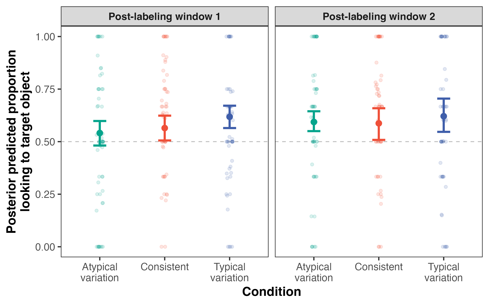
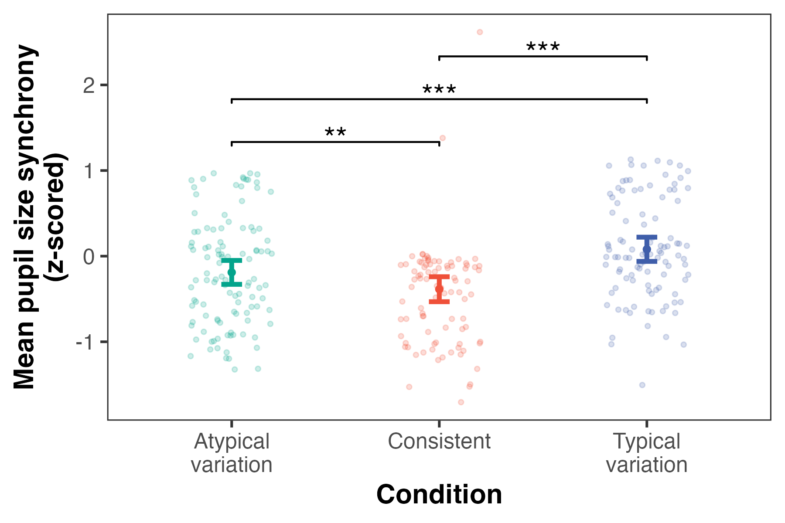

```{r setup}
library(tidyverse)
library(readxl)
library(english)
library(tools)
library(flextable)
library(brms)
library(loo)
library(emmeans)
library(lme4)
library(lmerTest)
library(tidybayes)
library(posterior)
library(ggsignif)
library(papaja)

# reprocess raw eye-tracking data? set to TRUE or FALSE
reprocess = FALSE
if (reprocess) {
  source("analysis/process.R")
}

# reprocess pupillometry data? set to TRUE or FALSE
reprocess.pupil = FALSE 
if (reprocess.pupil) {
  source("analysis/pupillometry.R")
}

# re-run brms models? set to TRUE or FALSE
rerun = FALSE

# set condition colors
condition.colors <- c("stable" = "#ef5039", 
                      "unnaturalv" = "#04a48c", 
                      "naturalv" = "#3f5eaa")

# create custom theme for consistent plotting
theme_custom <- function(base_size = 15) {
  theme_test(base_size = base_size) +
    theme(
      legend.position = "none",
      strip.text = element_text(face = "bold"),
      axis.title = element_text(face = "bold")
    )
}
```

# Introduction

Across many languages, speech addressed to infants and young children frequently includes "baby-talk" words that are unique or highly specific to this child-directed register [@bynon1968berber; @casagrande1948comanche; @ferguson1964baby; @han2023che; @mazuka2008japanese; @ota2018choo; @pye1986quiche; @sarvasy2025child]. Child-directed words are often variants of existing word forms in adult language but with some phonological and/or morphological change(s) [@moore2024wordform] or reference to iconic relationships [CITE], but can also share little to no overlap [e.g., *bunny* and *rabbit*, @soderstrom2007beyond]. While child-directed variants are eventually replaced by adult word forms in children's and caregivers' speech [@casey2022doggy], multiple lexical variants have been shown to be used seemingly interchangeably in children's early language environments [@caseyIPcorpus; @moore2024wordform]. How does exposure to this kind of label variation impact children's word learning?

The process of early word learning is traditionally framed as a one-to-one mapping problem---children learn to associate individual word forms (i.e., labels) with individual referents [@smith2008infant; but see also @wojcik2022map]. Under this view, label variation could be considered noise in the learning signal. Indeed, children often avoid adopting a second label for a referent they already have a name for---the 'mutual exclusivity bias' [@markman1988children; @markman2003use; @merriman1989mutual; but see also @mervis1994two]. Using multiple variants to label the exact same referent also violates the 'principle of contrast'---a pragmatic assumption that unique word forms must not share the exact same meaning [@clark1988logic].

However, young children successfully recognize [@potter2024frequent] and produce [@casey2022doggy] multiple labels for the same referent. Earlier-learned words tend to be associated with more variation [@caseyIPcorpus; @moore2024wordform], suggesting that learners successfully contend with a relatively complicated linguistic landscape from early in development. Additionally, some features of child-directed variants have been linked with early learnability. Reduplicated word forms, which include repetition of full or partial syllables (e.g., *woof-woof*, *bow-wow*), are relatively common in child-directed speech [CDS, though estimated rates vary substantially across languages, e.g., @han2023che; @mazuka2008japanese; @ota2018choo]. Ota and Skarabela [-@ota2016reduplicated] found that (Scottish) English-learning 17- to 19-month-olds learned reduplicated labels for novel objects better than non-reduplicated labels and cite three possible explanations of this pattern. Reduplicated labels may be more learnable because (1) repeated syllables are more salient in continuous speech and thus more segmentable [@ota2018reduplication], (2) syllable redundancy may facilitate more efficient phonological encoding [consistent with @damian2009exploring's work with English-speaking adults], and (3) adjacent repetition may lead to stronger lexical activation, supporting faster online word recognition.

Despite these competing possibilities, no studies to date have directly tested how consistent versus variable labels impact toddlers' ability to learn new words. The present study addresses this gap by manipulating the presence and type of label variation in a controlled, lab-based novel word learning task. In an eye-tracking study using a looking-while-listening (LWL) design [@fernald2008looking; @swingley2000spoken], English-hearing toddlers learned novel word-object mappings across three within-subjects conditions. In the *consistent* condition, toddlers heard repeated exposures to the exact same standard label. In two variation conditions, toddlers heard repetitions of the standard label in addition to two label variants. The *typical variation* condition featured label variants common in English CDS, including diminutivized and reduplicated word forms. The *atypical variation* condition featured phonologically altered word forms unattested in English CDS. Looking time measures were used to assess children's word-recognition accuracy, and pupil size synchrony measures were used to examine children's moment-to-moment engagement during learning.

## Hypotheses

For the effects of condition and age on children's novel word-recogntion accuracy, we pre-registered  (<https://osf.io/uqz6d>) the following predictions:

* In line with the vast majority of prior word learning studies conducted to date, which overwhelmingly test children's recognition of one-to-one mappings, we hypothesized that children would demonstrate successful learning in the *consistent* condition [CITES]. 
* The key condition of interest was the *typical variation* condition. We did not pre-register a specific directional hypothesis for this condition given competing theoretical predictions. If children successfully contend with variation attested in English CDS, then we should expect to see above-chance word-recognition accuracy in this condition. If this type of variation impedes novel word learning, then we should expect chance-level performance in this condition. 
* We hypothesized that words would be more difficult to learn in the *atypical variation* condition and that toddlers would show chance-level word-recognition accuracy on average for this condition.
* We also predicted that word-recognition accuracy would increase across age in our sample.\

We additionally pre-registered to test whether pupil size synchrony during the learning phase (a) differed between conditions and (b) predicted toddlers' word-recognition accuracy during the test phase [consistent with @nencheva2021moment].

# Method (1,332 words)

This study was pre-registered (<https://osf.io/uqz6d>). All stimuli, anonymized data, and analysis scripts are publicly available at LINK.

```{r, echo=FALSE}
log <- read_xlsx("data/metadata/ANON-ptcp-log.xlsx")
final.sample <- filter(log, usable_checked == "y") 
usable <- final.sample %>% nrow()
unusable <- filter(log, usable_checked == "n") %>% nrow() - 1 # subtracting since 1 child was accidentally double recruited
unusable.cal <- filter(log, str_detect(exclusion_reason, "calibration|refused")) %>% nrow()
unusable.data <- filter(log, str_detect(exclusion_reason, "trial")) %>% nrow()
unusable.inter <- filter(log, str_detect(exclusion_reason, "interruption")) %>% nrow()
unusable.lang <- filter(log, str_detect(exclusion_reason, "language")) %>% nrow()

ethnicity <- final.sample %>%
  mutate(ethnicity = case_when(
    ethnicity %in% c("black", "asian", "not reported") ~ str_to_sentence(ethnicity), 
    ethnicity == "white" ~ "Non-Latinx white", 
    ethnicity == "white/hispanic" ~ "Latinx white", 
    ethnicity %in% c("white/black", "asian/white", "mixed") ~ "Mixed race"
  )) %>%
  group_by(ethnicity) %>%
  summarize(n = n()) %>%
  ungroup() %>%
  mutate(prop = round(n/sum(n)*100, 2)) %>%
  arrange(desc(prop))

sex <- final.sample %>%
  group_by(sex) %>%
  summarize(n = n())

ages <- final.sample %>%
  transmute(id = str_extract(ptcp_id, "[0-9][0-9][0-9]"), 
            age_c = datawizard::standardize(age))

median.age <- median(final.sample$age)

ages.younger <- final.sample %>%
  filter(age < median.age) %>%
  transmute(id = str_extract(ptcp_id, "[0-9][0-9][0-9]"), 
            age_c = datawizard::standardize(age))

ages.older <- final.sample %>%
  filter(age > median.age) %>%
  transmute(id = str_extract(ptcp_id, "[0-9][0-9][0-9]"), 
            age_c = datawizard::standardize(age))
```

## Participants

Participants (*N* = `r usable` total, `r filter(sex, sex == "F")$n` female, `r filter(sex, sex == "M")$n` male), aged 18 to 36 months (*M*~age~ = `r format(round(mean(final.sample$age), 2), nsmall = 2)` months), were full-term, monolingual English-hearing children (\>80% reported exposure) with no known hearing, vision, language, and/or developmental delays and were recruited from a volunteer database. Caregivers reported race/ethnicity information for their children in an open-ended format when they initially signed up for the database. `r sub("^([a-z])", "\\U\\1", as.character(english(ethnicity[3,]$n)), perl = TRUE)` caregivers (`r ethnicity[3,]$prop`% of the final sample) chose not to report this information. Participants were primarily `r ethnicity[1,]$ethnicity` (*N* = `r ethnicity[1,]$n`, `r ethnicity[1,]$prop`%) with some representation of other races/ethnicities: Mixed race (*N* = `r ethnicity[2,]$n`, `r ethnicity[2,]$prop`%), Asian (*N* = `r ethnicity[4,]$n`, `r ethnicity[4,]$prop`%), Black (*N* = `r ethnicity[5,]$n`, `r ethnicity[5,]$prop`%), `r ethnicity[6,]$ethnicity` (*N* = `r ethnicity[6,]$n`, `r ethnicity[6,]$prop`%).

The final sample size was pre-registered and determined using an a priori power analysis conducted in G\*Power [@faul2009statistical] and informed by prior eye-tracking studies with a similar age range [@nencheva2021moment; @quam2023protracted]. `r sub("^([a-z])", "\\U\\1", as.character(english(unusable)), perl = TRUE)` additional children participated but were excluded from the final analyses due to refusal to wear the EyeLink target sticker or failure to complete calibration (*N* = `r unusable.cal`), significant interruption by a family member (*N* = `r unusable.inter`), contribution of too few usable trials based on pre-registered criteria due to fussiness or inattention (*N* = `r unusable.data`), or failure to meet the language requirement (*N* = `r unusable.lang`).

All experimental protocols, including procedures for obtaining informed consent, were approved by the Princeton University Institutional Review Board (Approval: 0000007117, Language Learning: Sounds, Words, and Grammar). Families received a \$10 digital gift card and a small gift for participating.

## Stimuli

```{r stimuli}
library(tuneR)
training.audio <- "stimuli/training_audio/"
testing.audio <- "stimuli/testing_audio/"

training.wavs <- list.files(path = training.audio, pattern = "\\.wav$", full.names = TRUE)
testing.wavs <- list.files(path = testing.audio, pattern = "\\.wav$", full.names = TRUE)

training.durs <- tibble(file = training.wavs) %>%
  mutate(
    name = basename(file),
    wav = map(file, readWave),
    dur = round(map_dbl(wav, ~ length(.x@left) / .x@samp.rate) * 1000, 0)
  ) %>%
  summarize(mean = round(mean(dur), 0),
            min = min(dur), 
            max = max(dur))

test.word.durs <- tibble(base_word = "bog", window = "first", dur = 615) %>%
  add_row(base_word = "bog", window = "second", dur = 613) %>%
  add_row(base_word = "mob", window = "first", dur = 621) %>%
  add_row(base_word = "mob", window = "second", dur = 621) %>%
  add_row(base_word = "kai", window = "first", dur = 622) %>%
  add_row(base_word = "kai", window = "second", dur = 628) %>%
  add_row(base_word = "tan", window = "first", dur = 625) %>%
  add_row(base_word = "tan", window = "second", dur = 628) %>%
  add_row(base_word = "voo", window = "first", dur = 630) %>%
  add_row(base_word = "voo", window = "second", dur = 626) %>%
  add_row(base_word = "woi", window = "first", dur = 627) %>%
  add_row(base_word = "voo", window = "second", dur = 634) %>%
  summarize(mean = round(mean(dur), 0),
            min = min(dur), 
            max = max(dur))
  
testing.dur <- tibble(file = testing.wavs) %>%
  mutate(
    name = basename(file),
    wav = map(file, readWave),
    dur = round(map_dbl(wav, ~ length(.x@left) / .x@samp.rate) * 1000, 0)
  ) %>%
  select(dur) %>%
  distinct() %>%
  pull(dur) - 4000 # accounting for 2 x 2000ms silent periods before and after trial
```

Auditory stimuli were recorded by a female native English speaker using naturalistic child-directed prosody in a sound-attenuated room. Each target word (see **Table 1**) appeared in four different sentence frames for exposure trials ("Look, \_\_\_\_\_! That's a \_\_\_\_\_. Do you see the \_\_\_\_\_\_? Yes, that's a \_\_\_\_\_\_.") and in two different sentence frames for test trials ["Can you find the \_\_\_\_\_? See the \_\_\_\_\_?", following the test trial structure of @ota2016reduplicated]. Trials were created in Praat [@praat] by concatenating each target word onto the final position of each sentence frame. To avoid co-articulation artifacts in trials with articles preceding the target word, the target words were spliced along with the article. Exposure trials were `r format(training.durs$mean, scientific = FALSE, big.mark = ",")` ms long, on average (range = `r format(training.durs$min, scientific = FALSE, big.mark = ",")`--`r format(training.durs$max, scientific = FALSE, big.mark = ",")`ms), including 2,000 ms silent periods between exposure sentences. Test trials were all exactly `r format(testing.dur, scientific = FALSE, big.mark = ",")` ms long, with target word durations ranging from `r test.word.durs$min` to `r test.word.durs$max` ms (*M* = `r test.word.durs$mean` ms), and including 2,000 ms of silence between target sentences. All auditory stimuli were normed to a standard mean intensity of 65dB [@praat]. Minor acoustic edits were made on some sentences to ensure that all trials sounded naturally produced and had comparable loudness and pitch.

```{r stimuli-table}
#| tbl-cap: "Table 1. Target word forms by variant type."

stimuli_table <- tribble(
  ~Standard, ~`Reduplicated (Typical)`, ~`Reduplicated (Atypical)`, ~`Diminutivized (Typical)`, ~`Diminutivized (Atypical)`,
  "tanzer (/tæn.zɚ/)",  "tan-tan (/tæn.tæn/)",   "zer-zer (/zɚ.zɚ/)",    "tanny (/tæn.i/)",       "y-zer (/i.zɚ/)",
  "bogdum (/bɑg.dʌm/)", "bog-bog (/bɑg.bɑg/)",   "dum-dum (/dʌm.dʌm/)",  "boggy (/bɑg.i/)",       "y-dum (/i.dʌm/)",
  "kaisol (/kaɪ.sɔl/)", "kai-kai (/kaɪ.kaɪ/)",   "sol-sol (/sɔl.sɔl/)",  "kaisy (/kaɪ.si/)",      "y-sol (/i.sɔl/)",
  "mobet (/moʊ.bɛt/)",  "mo-mo (/moʊ.moʊ/)",     "bet-bet (/bɛt.bɛt/)",  "moby (/moʊ.bi/)",       "y-bet (/i.bɛt/)",
  "woifer (/wɔɪ.fɚ/)",  "woi-woi (/wɔɪ.wɔɪ/)",   "fer-fer (/fɚ.fɚ/)",    "woify (/wɔɪ.fi/)",      "y-fer (/i.fɚ/)",
  "voopin (/vu.pɪn/)",  "voo-voo (/vu.vu/)",     "pin-pin (/pɪn.pɪn/)",  "voopy (/vu.pi/)",       "y-pin (/i.pɪn/)"
)

apa_table(stimuli_table)
```

The visual stimuli consisted of six isoluminant objects with 12 unique colors (two per object) that were modeled after @nencheva2021moment's stimuli and hand-drawn using Procreate software [@procreate].

## Procedure

Toddlers sat on their caregiver's lap, approximately 60cm away from a 17-inch monitor equipped with an EyeLink 1000 Plus eye-tracker, in a dimly-lit testing room. Caregivers wore opague sunglasses to prevent them from influencing their children's behavior. Participants wore a small EyeLink target sticker on their forehead. We used a three-point calibration procedure along the horizontal dimension (x-axis) of the screen.

The experiment consisted of three blocks (one per condition). Each block consisted of two phases: an exposure phase, during which participants learned novel word-object pairings, and a test phase, during which toddlers were immediately tested on their recognition of the word-object mappings. An isoluminant, non-linguistic, attention-getting video was shown after every block.

During the exposure phase (four trials per block), children learned two novel word-object mappings. Each exposure trial started after a short, variable-length ITI (mean = 500 ms, range = 250--750 ms) or when the participant looked at the screen. During each exposure trial, a single target object appeared silently on the screen for 1,500 ms or until the participant looked at the screen. Then, the exposure audio played (see stimulus details above). After the offset of the audio, the target object remained on the screen for an additional 1,500 ms.

During the test phase (four trials per block), toddlers saw the two objects from the preceding exposure phase side-by-side on the screen. Each trial started with an ITI (same structure as training phase), followed by a 2,000 ms silent period with both objects on the screen. Then, the target audio played (see stimulus details above). After the offset of the audio, the side-by-side objects remained on the screen for an additional 2,000 ms.

## Conditions

Participants learned words in three conditions (within-subjects manipulation). In all conditions, participants learned the names of two different novel objects across four alternating exposure trials (two per word). In the *consistent* condition, participants heard the standard form of the target word repeated 5x per trial (e.g., "Look, tanzer! That's a tanzer...tanzer. Do you see the tanzer? Yes, that's a tanzer."). In the *typical variation* condition, participants heard the standard form of the target word repeated 2x per trial in addition to one reduplicated form and one diminutivized form per trial (e.g., "Look, tanzer! That's a tan-tan. Do you see the tanny? Yes, that's a tanzer."). Critically, the number of exposures to the first syllable of the target word (i.e., "tan") was equivalent across these two conditions. In the *atypical variation* condition, participants heard the standard form of the target word repeated 2x per trial in addition to 1x exposure each of reversed versions of the typical reduplicated and diminutivized forms (e.g., "Look, tanzer! That's a zer-zer. Do you see the y-zer? Yes, that's a tanzer."). A full list of exposed word forms can be found in **Table 1**.

Participants were assigned to one of 18 pseudorandomized orders such that the order of presentation of blocks and the assignment of target labels to target objects was counterbalanced across conditions. Target locations were also counterbalanced such that the target object appeared 50% of time on the left and 50% of the time on the right.

```{r usable-stats}
path <- "data/processed/usable/"
usable <- tibble()
for (i in list.files(path)) {
  usable <- bind_rows(usable, 
                      read_csv(paste0(path, i), show_col_types = FALSE))
}

n.conditions <- usable %>%
  group_by(id) %>%
  summarize(n = length(unique(condition))) %>%
  ungroup() %>%
  summarize(mean = round(mean(n), 2),
            median = round(median(n), 2),
            min = min(n),
            max = max(n))

n.trials <- usable %>%
  group_by(id) %>%
  summarize(n = length(unique(trial))) %>%
  ungroup() %>%
  summarize(mean = round(mean(n), 2),
            median = round(median(n), 2),
            min = min(n),
            max = max(n))
```

## Data pre-processing

Gaze behavior was used to determine toddlers' recognition of novel word-object pairings during two critical windows of analysis [300--2,000 ms following each target word onset, @fernald2008looking; @swingley2000spoken]. We included two instances of the target word during test trials to ensure that children had sufficient opportunity to demonstrate their recognition of novel word-object mappings. We calculated participants' proportion looking to target objects during test trials as the measure of word-recognition accuracy. For any given test trial to be included in analyses, children must have looked to the target and/or distractor object at least once prior to the onset of the first label and for at least 1/3 of each critical post-labeling window. In order for a block to be included, children must have contributed usable data for at least two of four test trials. Finally, in order for a participant to be included, they must have contributed at least two of three blocks. On average, participants contributed `r n.trials$mean` trials (median = `r format(round(n.trials$median, 2), nsmall = 2)`, range = `r n.trials$min`--`r n.trials$max`) across `r n.conditions$mean` conditions (median = `r n.conditions$median`).

Following @nencheva2021moment, we first converted toddlers' raw pupil size values during exposure sentences (automatically recorded by the EyeLink eye-tracker) to percent change from the average pupil size for that trial. We removed potential artifacts due to partial blinks by excluding any 50ms intervals with more than 15% change in pupil size [@merritt1994artifact]. We used Stineman interpolation to fill in gaps shorter than 100 ms [@stinepack]. Finally, we excluded participants' data for exposure sentences where more than 50% of the pupil size data was missing (e.g., due to the child looking away from the screen or technical error).

# Results (1,028 words)

## Word recognition measured by gaze behavior

```{r test-prep}
rewrite = FALSE
path <- "data/processed/"

if (rewrite) {
  test.props <- tibble()
  test.props.bywindow <- tibble()
  frames <- tibble()
  frames.cbp <- tibble()
  
  included.files <- list.files(path, "-test.csv")
  
  for (i in included.files) {
    
    curr.file <- read_csv(paste0(path, i))
    
    id <- str_extract(unique(curr.file$pid), "[0-9][0-9][0-9]")
    
    status <- filter(log, str_detect(ptcp_id, id))$usable_checked
    
    if (status != "n" & !is.na(status)) {
      # read in usable trials from pre-processing stage
      usable.trials <- read_csv(paste0("data/processed/usable/", id, ".csv")) %>%
        pull(trial)
      
      if (length(usable.trials) > 0) {
        
      curr.file.cbp <- curr.file %>% 
        select(pid, age_m, order, trial, x, pupil, base_word:window) %>%
        filter(trial %in% usable.trials) %>%
        group_by(pid, trial, condition, fix, base_word, window) %>%
        filter(length(unique(frame)) >= (2000-300)/3) %>%
        ungroup()
        
      curr.file <- curr.file %>%
        select(pid, age_m, order, trial, x, pupil, base_word:window) %>%
        filter(trial %in% usable.trials & !is.na(window)) %>%
        group_by(pid, trial, condition, fix, base_word, window) %>%
        filter(length(unique(frame)) >= (2000-300)/3) %>%
        ungroup()

      curr.test.props <- curr.file %>%
        group_by(pid, trial, condition, fix, base_word) %>%
        summarize(total = n()) %>%
        pivot_wider(names_from = "fix", values_from = "total",
                    id_cols = c(pid, trial, condition, base_word))

      curr.test.props.bywindow <- curr.file %>%
        group_by(pid, trial, condition, fix, base_word, window) %>%
        summarize(total = n()) %>%
        pivot_wider(names_from = "fix", values_from = "total",
                    id_cols = c(pid, trial, condition, base_word, window))

      if ("target" %in% colnames(curr.test.props)) {
        curr.test.props <- curr.test.props %>%
          mutate(target = ifelse(is.na(target), 0, target))

      } else {
        curr.test.props <- curr.test.props %>%
          mutate(target = 0)
      }

      if ("distracter" %in% colnames(curr.test.props)) {
        curr.test.props <- curr.test.props %>%
          mutate(distracter = ifelse(is.na(distracter), 0, distracter))
      } else {
        curr.test.props <- curr.test.props %>%
          mutate(distracter = 0)
      }

      curr.test.props <- curr.test.props %>%
        mutate(total = target + distracter,
               prop = target/total)

      test.props <- bind_rows(test.props, curr.test.props)

      if ("target" %in% colnames(curr.test.props.bywindow)) {
        curr.test.props.bywindow <- curr.test.props.bywindow %>%
          mutate(target = ifelse(is.na(target), 0, target))

      } else {
        curr.test.props.bywindow <- curr.test.props.bywindow %>%
          mutate(target = 0)
      }

      if ("distracter" %in% colnames(curr.test.props.bywindow)) {
        curr.test.props.bywindow <- curr.test.props.bywindow %>%
          mutate(distracter = ifelse(is.na(distracter), 0, distracter))
      } else {
        curr.test.props.bywindow <- curr.test.props.bywindow %>%
          mutate(distracter = 0)
      }

      curr.test.props.bywindow <- curr.test.props.bywindow %>%
        mutate(total = target + distracter,
               prop = target/total)

      test.props.bywindow <- bind_rows(test.props.bywindow, curr.test.props.bywindow)

      curr.frames <- curr.file %>%
        select(pid, age_m, order, trial, x, pupil, base_word:window) %>%
        filter(trial %in% usable.trials) %>%
        mutate(fix_num = case_when(
          fix == "distracter" ~ 0,
          fix == "target" ~ 1,
          TRUE ~ NA
        ))
      
      curr.frames.cbp <- curr.file.cbp %>%
        select(pid, age_m, order, trial, x, pupil, base_word:window) %>%
        filter(trial %in% usable.trials) %>%
        mutate(fix_num = case_when(
          fix == "distracter" ~ 0, 
          fix == "target" ~ 1, 
          TRUE ~ NA
        ))
      
      frames <- bind_rows(frames, curr.frames)
      frames.cbp <- bind_rows(frames.cbp, curr.frames.cbp)
      
      }
    }
  }
  
  # export proportion looking data
  write_csv(test.props, "data/test-props.csv")
  write_csv(test.props.bywindow, "data/test-props-bywindow.csv")
  
  # export full timecourse data
    data <- frames %>%
      mutate(time = frame,
             condition = factor(condition, levels = c("unnaturalv", "stable", "naturalv"))) %>%
      select(pid, age_m, order, trial, condition, base_word, pupil, time, fix_num, window,
             first_label, second_label) %>%
      group_by(pid) %>%
      mutate(block_order = list(unique(condition))) %>%
      ungroup() %>%
      mutate(condition_order = map2_int(block_order, condition, ~which(.x == .y)))
    write_csv(data, "data/prepped-data.csv")
    
    # export eyetrackingR version of data
    eyetrackingr.data <- frames.cbp %>%
      mutate(time = frame, 
             condition = factor(condition, levels = c("unnaturalv", "stable", "naturalv"))) %>%
      mutate(target = ifelse(fix_num == 1, 1, 0),
             distracter = ifelse(fix_num == 0, 1, 0)) %>%
      select(-fix_num)
    write_csv(eyetrackingr.data, "data/eyetrackingr-data.csv")
} else {
  data <- read_csv("data/prepped-data.csv")
  test.props <- read_csv("data/test-props.csv")
  test.props.bywindow <- read_csv("data/test-props-bywindow.csv")
  eyetrackingr.data <- read_csv("data/eyetrackingr-data.csv")
}
```

```{r test-bayes, results = "hide"}
model.data <- test.props %>%
  mutate(id = str_extract(pid, "[0-9][0-9][0-9]")) %>%
  left_join(ages, by = "id") %>%
  mutate(condition = relevel(as.factor(condition), ref = "unnaturalv"))

model.data.younger <- test.props %>%
  mutate(id = str_extract(pid, "[0-9][0-9][0-9]")) %>%
  right_join(ages.younger, by = "id") %>%
  mutate(condition = relevel(as.factor(condition), ref = "unnaturalv"))

model.data.older <- test.props %>%
  mutate(id = str_extract(pid, "[0-9][0-9][0-9]")) %>%
  right_join(ages.older, by = "id") %>%
  mutate(condition = relevel(as.factor(condition), ref = "unnaturalv"))

model.data.bywindow <- test.props.bywindow %>%
  mutate(id = str_extract(pid, "[0-9][0-9][0-9]")) %>%
  left_join(ages, by = "id") %>%
  mutate(condition = relevel(as.factor(condition), ref = "unnaturalv"))

model.data.older.bywindow <- test.props.bywindow %>%
  mutate(id = str_extract(pid, "[0-9][0-9][0-9]")) %>%
  right_join(ages.older, by = "id") %>%
  mutate(condition = relevel(as.factor(condition), ref = "unnaturalv"))

model.data.younger.bywindow <- test.props.bywindow %>%
  mutate(id = str_extract(pid, "[0-9][0-9][0-9]")) %>%
  right_join(ages.younger, by = "id") %>%
  mutate(condition = relevel(as.factor(condition), ref = "unnaturalv"))

if (rerun) {
  m.age <- brm(
    bf(prop ~ condition + age_c + (1 + condition | id) + (1 + condition + age_c | base_word),
     phi ~ condition + age_c,
     zoi ~ condition + age_c,
     coi ~ condition + age_c),
  data = model.data,
  family = zero_one_inflated_beta(),
  chains = 4,
  cores = 4,
  save_pars = save_pars(all = TRUE),
  iter = 2000,
  warmup = 1000,
  seed = 20250803,
  control = list(adapt_delta = 0.999)
  )
  saveRDS(m.age, file = "models/m-age.rds")
  
  m.younger <- brm(
    bf(prop ~ condition + age_c + (1 + condition | id) + (1 + condition + age_c | base_word),
     phi ~ condition + age_c,
     zoi ~ condition + age_c,
     coi ~ condition + age_c),
  data = model.data.younger,
  family = zero_one_inflated_beta(),
  chains = 4,
  cores = 4,
  save_pars = save_pars(all = TRUE),
  iter = 2000,
  warmup = 1000,
  seed = 20250803,
  control = list(adapt_delta = 0.999)
  )
  saveRDS(m.younger, file = "models/m-younger.rds")
  
    m.older <- brm(
    bf(prop ~ condition + age_c + (1 + condition | id) + (1 + condition + age_c | base_word),
     phi ~ condition + age_c,
     zoi ~ condition + age_c,
     coi ~ condition + age_c),
  data = model.data.older,
  family = zero_one_inflated_beta(),
  chains = 4,
  cores = 4,
  save_pars = save_pars(all = TRUE),
  iter = 2000,
  warmup = 1000,
  seed = 20250803,
  control = list(adapt_delta = 0.999)
  )
  saveRDS(m.older, file = "models/m-older.rds")
  
    m.younger.window1 <- brm(
    bf(prop ~ condition + age_c + (1 + condition | id) + (1 + condition + age_c | base_word),
     phi ~ condition + age_c,
     zoi ~ condition + age_c,
     coi ~ condition + age_c),
  data = filter(model.data.younger.bywindow, window == "first"),
  family = zero_one_inflated_beta(),
  chains = 4,
  cores = 4,
  save_pars = save_pars(all = TRUE),
  iter = 2000,
  warmup = 1000,
  seed = 20250803,
  control = list(adapt_delta = 0.999)
  )
  saveRDS(m.younger.window1, file = "models/m-younger-window1.rds")
  
m.younger.window2 <- brm(
    bf(prop ~ condition + age_c + (1 + condition | id) + (1 + condition + age_c | base_word),
     phi ~ condition + age_c,
     zoi ~ condition + age_c,
     coi ~ condition + age_c),
  data = filter(model.data.younger.bywindow, window == "second"),
  family = zero_one_inflated_beta(),
  chains = 4,
  cores = 4,
  save_pars = save_pars(all = TRUE),
  iter = 2000,
  warmup = 1000,
  seed = 20250803,
  control = list(adapt_delta = 0.999)
  )
  saveRDS(m.younger.window2, file = "models/m-younger-window2.rds")
  
  m.older.window1 <- brm(
    bf(prop ~ condition + age_c + (1 + condition | id) + (1 + condition + age_c | base_word),
     phi ~ condition + age_c,
     zoi ~ condition + age_c,
     coi ~ condition + age_c),
  data = filter(model.data.older.bywindow, window == "first"), 
  family = zero_one_inflated_beta(),
  chains = 4,
  cores = 4,
  save_pars = save_pars(all = TRUE),
  iter = 2000,
  warmup = 1000,
  seed = 20250803,
  control = list(adapt_delta = 0.999)
  )
  saveRDS(m.older.window1, file = "models/m-older-window1.rds")
  
    
  m.older.window2 <- brm(
    bf(prop ~ condition + age_c + (1 + condition | id) + (1 + condition + age_c | base_word),
     phi ~ condition + age_c,
     zoi ~ condition + age_c,
     coi ~ condition + age_c),
  data = filter(model.data.older.bywindow, window == "second"), 
  family = zero_one_inflated_beta(),
  chains = 4,
  cores = 4,
  save_pars = save_pars(all = TRUE),
  iter = 2000,
  warmup = 1000,
  seed = 20250803,
  control = list(adapt_delta = 0.999)
  )
  saveRDS(m.older.window2, file = "models/m-older-window2.rds")
  
  m.age.int <- brm(
  bf(prop ~ condition * age_c + (1 + condition | id) + (1 + condition * age_c | base_word),
     phi ~ condition * age_c,
     zoi ~ condition * age_c,
     coi ~ condition * age_c),
  data = model.data,
  family = zero_one_inflated_beta(),
  chains = 4,
  cores = 4,
  save_pars = save_pars(all = TRUE),
  iter = 2000,
  warmup = 1000,
  seed = 20250803,
  control = list(adapt_delta = 0.999)
  )
  saveRDS(m.age.int, file = "models/m-age-int.rds")
  
  
    
  m.window <- brm(
  bf(prop ~ condition * window + age_c + (1 + condition * window | id) + (1 + condition * window + age_c | base_word),
     phi ~ condition * window + age_c,
     zoi ~ condition * window + age_c,
     coi ~ condition * window + age_c),
  data = model.data.bywindow,
  family = zero_one_inflated_beta(),
  chains = 4,
  cores = 4,
  iter = 4000,
  warmup = 2000,
  seed = 20250803,
  control = list(adapt_delta = 0.999)
)
  saveRDS(m.window, file = "models/m-window.rds")

  
  m.window1 <- brm(
  bf(prop ~ condition + age_c + (1 + condition | id) + (1 + condition + age_c | base_word),
     phi ~ condition + age_c,
     zoi ~ condition + age_c,
     coi ~ condition + age_c),
  data = filter(model.data.bywindow, window == "first"),
  family = zero_one_inflated_beta(),
  chains = 4,
  cores = 4,
  iter = 2000,
  warmup = 1000,
  seed = 20250803,
  control = list(adapt_delta = 0.999)
)
  saveRDS(m.window1, file = "models/m-window1.rds")

  m.window2 <- brm(
  bf(prop ~ condition + age_c + (1 + condition | id) + (1 + condition + age_c | base_word),
     phi ~ condition + age_c,
     zoi ~ condition + age_c,
     coi ~ condition + age_c),
  data = filter(model.data.bywindow, window == "second"),
  family = zero_one_inflated_beta(),
  chains = 4,
  cores = 4,
  iter = 2000,
  warmup = 1000,
  seed = 20250803,
  control = list(adapt_delta = 0.999)
)
  saveRDS(m.window2, file = "models/m-window2.rds")
  
  # compare models (pre-registered plan)
  loo1 <- loo(m.age, moment_match = TRUE, reloo = TRUE)
  loo2 <- loo(m.age.int, moment_match = TRUE, reloo = TRUE)
  comp <- loo_compare(loo1, loo2) %>%
    as_tibble() %>%
    tibble::rownames_to_column(var = "model") %>%
    write_csv("models/compare.csv")
} else {
  m.age <- readRDS("models/m-age.rds")
  m.age.int <- readRDS("models/m-age-int.rds")
  m.window1 <- readRDS("models/m-window1.rds")
  m.window2 <- readRDS("models/m-window2.rds")
  comp <- read_csv("models/compare.csv")
}

first.window <- 300:2000
second.window <- (mean(data$second_label) - 
                    mean(data$first_label) + 300):(mean(data$second_label) - 
                                                        mean(data$first_label)+2000)

library(tidybayes)
# summarize posterior
m.age_summary <- as_draws_df(m.age) %>%
    pivot_longer(cols = starts_with("b_"), 
                 names_to = "parameter", 
                 values_to = "value") %>%
  group_by(parameter) %>%
  mean_qi(.width = 0.89) %>%
  select(parameter, starts_with("value"))

m.window1_summary <- as_draws_df(m.window1) %>%
    pivot_longer(cols = starts_with("b_"), 
                 names_to = "parameter", 
                 values_to = "value") %>%
  group_by(parameter) %>%
  mean_qi(.width = 0.89) %>%
  select(parameter, starts_with("value"))

m.window2_summary <- as_draws_df(m.window2) %>%
    pivot_longer(cols = starts_with("b_"), 
                 names_to = "parameter", 
                 values_to = "value") %>%
  group_by(parameter) %>%
  mean_qi(.width = 0.89) %>%
  select(parameter, starts_with("value"))
```

```{r posterior-predictions}
# generate posterior predictions per condition
newdata <- data.frame(
  condition = factor(c("unnaturalv", "stable", "naturalv"), levels = levels(model.data.older$condition)), 
  age_c = 0
)

# get fitted estimates of the mean (mu parameter of the beta)
preds <- posterior_epred(m.age, newdata = newdata, re_formula = NA)
preds_window1 <- posterior_epred(m.window1, newdata = newdata, re_formula = NA)
preds_window2 <- posterior_epred(m.window2, newdata = newdata, re_formula = NA)

# calculate means and 89% credible intervals
pred_summary <- as.data.frame(preds) %>%
  setNames(levels(newdata$condition)) %>%
  pivot_longer(everything(), names_to = "condition", values_to = "mu") %>%
  group_by(condition) %>%
  summarize(
    mean = mean(mu),
    ci_lower = quantile(mu, probs = 0.055, names = FALSE),
    ci_upper = quantile(mu, probs = 0.945, names = FALSE)
  )

pred_summary1 <- as.data.frame(preds_window1) %>%
  setNames(levels(newdata$condition)) %>%
  pivot_longer(everything(), names_to = "condition", values_to = "mu") %>%
  group_by(condition) %>%
  summarize(
    mean = mean(mu),
    ci_lower = quantile(mu, 0.055),
    ci_upper = quantile(mu, 0.945)
  )

pred_summary2 <- as.data.frame(preds_window2) %>%
  setNames(levels(newdata$condition)) %>%
  pivot_longer(everything(), names_to = "condition", values_to = "mu") %>%
  group_by(condition) %>%
  summarize(
    mean = mean(mu),
    ci_lower = quantile(mu, 0.055),
    ci_upper = quantile(mu, 0.945)
  )

draws <- as_draws_df(m.age)
summary <- summarize_draws(draws)
```

Our primary analysis examined whether children successfully learned the novel-word object mappings across the three experimental conditions. Using the `brms` package [@brms], we fit a mixed-effects zero-one inflated beta regression model[^1] to examine the effects of condition and age on children's accuracy of novel word recognition (i.e., proportion looking to the target object). The model included fixed effects for condition (atypical variation vs. consistent vs. typical variation) and mean-centered age, along with the maximal random effects structure (by-participant and by-item random slopes and intercepts). We used weakly informative priors (standard normal distributions) and fitted the model using Hamiltonian Monte Carlo sampling (four chains, four cores) implemented in Stan [@rstan]. All $\hat{R}$ values were 1.00, indicating good convergence. Effective sample sizes (Bulk ESS: `r round(min(summary$ess_bulk, na.rm = TRUE), 0)`--`r format(round(max(summary$ess_bulk, na.rm = TRUE), 0), big.mark = ",")`; Tail ESS: `r round(min(summary$ess_tail, na.rm = TRUE), 0)`--`r format(round(max(summary$ess_tail, na.rm = TRUE), 0), big.mark = ",")`) were sufficiently large, indicating stable and reliable posterior estimates.

[^1]: Beta regression was chosen to model the proportional dependent variable [@cribari2010beta]. Specifically, we used a zero-one-inflated model since 0s and 1s were common values in our data [@liu2018review]. Note that this particular modeling approach requires a Bayesian framework to interpret. Importantly, this analytic approach allows us to quantify evidence in support of the null hypothesis, not simply against it. A frequentist beta regression using the `glmmTMB` package [@glmmTMB] roughly approximated the same trend, but this approach is limited in two key ways: (a) this model cannot accurately capture boundary values [see @liu2018review for relevant discussion], and (b) the model fails to converge with the maximal random effects structure, which forced us to remove the random slope for condition and thus reduced our ability to detect within-subject effects of condition.

Following our pre-registered analysis plan, we tested whether including an interaction between condition and age improved model fit---we compared the model with the interaction term to the simpler additive model using approximate leave-one-out cross-validation [LOO, @loo]. This analysis suggested no reliable difference in predictive accuracy, providing no strong evidence that the interaction term improved model fit (ΔELPD = `r format(round(filter(comp, model == 2)$elpd_diff, 2), nsmall = 2)`, ΔSE = `r format(round(filter(comp, model == 2)$se_diff, 2), nsmall = 2)`).

Children's performance was reliably above chance overall and in both critical windows across all conditions, with one exception: in the first critical window for the atypical variation condition where children's looking behavior was at chance level (*M* = `r format(round(filter(pred_summary1, condition == "unnaturalv")$mean, 2))`, 89% CrI \[`r format(round(filter(pred_summary1, condition == "unnaturalv")$ci_lower, 2))`, `r format(round(filter(pred_summary1, condition == "unnaturalv")$ci_upper, 2))`\]). Across both critical windows, model-predicted accuracy was highest in the typical variation condition (*M* = `r format(round(filter(pred_summary, condition == "naturalv")$mean, 2))`, 89% CrI \[`r format(round(filter(pred_summary, condition == "naturalv")$ci_lower, 2))`, `r format(round(filter(pred_summary, condition == "naturalv")$ci_upper, 2))`\]), followed by the consistent condition (*M* = `r format(round(filter(pred_summary, condition == "stable")$mean, 2))`, 89% CrI \[`r format(round(filter(pred_summary, condition == "stable")$ci_lower, 2))`, `r format(round(filter(pred_summary, condition == "stable")$ci_upper, 2))`\]), and lowest in the atypical variation condition (*M* = `r format(round(filter(pred_summary, condition == "unnaturalv")$mean, 2))`, 89% CrI \[`r format(round(filter(pred_summary, condition == "unnaturalv")$ci_lower, 2))`, `r format(round(filter(pred_summary, condition == "unnaturalv")$ci_upper, 2))`\]). **Figure 1** shows model-predicted accuracy across conditions for the two critical windows. **Table 2** shows all model parameter estimates for fixed effects, and below, we break down the key results that are of theoretical interest.

```{r fig1, fig.cap="Figure 1. Posterior predicted accuracy by condition across both post-labeling time windows. Point ranges reflect posterior means with 89% credible intervals. Jittered dots show raw means for individual participants. Dotted line at 0.5 indicates chance looking.", fig.width = 8, fig.height = 5}

raw_summary <- model.data.bywindow %>%
  mutate(condition = factor(condition, levels = c("unnaturalv", "stable", "naturalv"))) %>%
  group_by(pid, condition, window) %>%
  summarize(prop = mean(prop)) %>%
  ungroup() %>%
  mutate(model = ifelse(window == "first", "Post-labeling window 1", "Post-labeling window 2"))

pred_summary1 <- pred_summary1 %>%
  mutate(model = "Post-labeling window 1")

pred_summary2 <- pred_summary2 %>%
  mutate(model = "Post-labeling window 2")

pred_all <- bind_rows(pred_summary1, pred_summary2) %>%
  mutate(
    model = factor(model, levels = c("Post-labeling window 1", "Post-labeling window 2")),
    condition = factor(condition, levels = c("unnaturalv", "stable", "naturalv"))
  )

fig1 <- ggplot(pred_all, aes(x = condition, y = mean, ymin = ci_lower, ymax = ci_upper, color = condition)) +
  geom_hline(yintercept = 0.5, linetype = "dashed", color = "gray") + 
    geom_jitter(data = raw_summary, 
                mapping = aes(x = condition, 
                              y = prop, 
                              color = condition), 
              inherit.aes = FALSE, alpha = 0.15,  width = 0.05, size = 1.5) + 
  geom_point(size = 3, position = position_dodge(width = 0.5)) +
  geom_errorbar(width = 0.2, size = 1.2, position = position_dodge(width = 0.5)) +
  facet_wrap(~model) +
  scale_color_manual(values = condition.colors) +
  scale_x_discrete(labels = c("Atypical\nvariation", 
                              "Consistent", 
                              "Typical\nvariation")) + 
  labs(
    x = "Condition",
    y = "Posterior predicted proportion\nlooking to target object",
    color = "Condition"
  ) +
  theme_custom()
ggsave("Figure1.png", fig1, width = 8, height = 5, dpi = 300)

```

The beta ($\mu$) component of the model, which estimates effects on the mean outcome for non-boundary values (i.e., proportions between but not including 0 or 1) showed positive effects for both the typical variation condition (*β* = `r format(round(filter(m.age_summary, parameter == "b_conditionnaturalv")$value, 2), nsmall = 2)`, 89% CrI: \[`r format(round(filter(m.age_summary, parameter == "b_conditionnaturalv")$value.lower, 2), nsmall = 2)`, `r format(round(filter(m.age_summary, parameter == "b_conditionnaturalv")$value.upper, 2), nsmall = 2)`\]) and the consistent condition (*β* = `r format(round(filter(m.age_summary, parameter == "b_conditionstable")$value, 2), nsmall = 2)`, 89% CrI: \[`r format(round(filter(m.age_summary, parameter == "b_conditionstable")$value.lower, 2), nsmall = 2)`, `r format(round(filter(m.age_summary, parameter == "b_conditionstable")$value.upper, 2), nsmall = 2)`\]), relative to the atypical variation condition. Although the credible intervals include zero, the direction and magnitude of these effects suggest a possible learning advantage for both typical variation and consistency over atypical variation. The effect of mean-centered age was negligible (*β* = `r format(round(filter(m.age_summary, parameter == "b_age_c")$value, 2), nsmall = 2)`, 89% CrI: \[`r format(round(filter(m.age_summary, parameter == "b_age_c")$value.lower, 2), nsmall = 2)`, `r format(round(filter(m.age_summary, parameter == "b_age_c")$value.upper, 2), nsmall = 2)`\]).

The conditional one-inflation (coi) component, which estimates among boundary values only the probability of being 1 (vs. 0), also showed similar trends for the effect of condition. Results showed positive effects of both the typical variation condition (*β* = `r format(round(filter(m.age_summary, parameter == "b_coi_conditionnaturalv")$value, 2), nsmall = 2)`, 89% CrI: \[`r format(round(filter(m.age_summary, parameter == "b_coi_conditionnaturalv")$value.lower, 2), nsmall = 2)`, `r format(round(filter(m.age_summary, parameter == "b_coi_conditionnaturalv")$value.upper, 2), nsmall = 2)`\]) and consistent condition (*β* = `r format(round(filter(m.age_summary, parameter == "b_coi_conditionstable")$value, 2), nsmall = 2)`, 89% CrI: \[`r format(round(filter(m.age_summary, parameter == "b_coi_conditionstable")$value.lower, 2), nsmall = 2)`, `r format(round(filter(m.age_summary, parameter == "b_coi_conditionstable")$value.upper, 2), nsmall = 2)`\]), relative to the atypical variation condition. While these effects remain uncertain given the credible interval overlap with zero, their alignment with the ($\mu$) component estimates, suggests additional evidence for an advantage of both typical variation and consistency over atypical variation. The effect of age was clearly positive (*β* = `r format(round(filter(m.age_summary, parameter == "b_coi_age_c")$value, 2), nsmall = 2)`, 89% CrI: \[`r format(round(filter(m.age_summary, parameter == "b_coi_age_c")$value.lower, 2), nsmall = 2)`, `r format(round(filter(m.age_summary, parameter == "b_coi_age_c")$value.upper, 2), nsmall = 2)`\]), indicating that older children were more likely to perform at ceiling (i.e., demonstrate 100% looking to the target object during the critical analysis windows).

```{r main-effects-table-prep}
format_est <- function(df, param) {
  row <- filter(df, parameter == param)
  sprintf("%.2f [%.2f, %.2f]", row$value, row$value.lower, row$value.upper)
}
params <- tribble(
  ~Effect, ~Param,
  "μ: condition (typical variation)", "b_conditionnaturalv",
  "μ: condition (consistent)", "b_conditionstable",
  "μ: age", "b_age_c",
  "zoi: condition (typical variation)", "b_zoi_conditionnaturalv",
  "zoi: condition (consistent)", "b_zoi_conditionstable",
  "zoi: age", "b_zoi_age_c",
  "coi: condition (typical variation)", "b_coi_conditionnaturalv",
  "coi: condition (consistent)", "b_coi_conditionstable",
  "coi: age", "b_coi_age_c"
)

summary_table <- params %>%
  mutate(
    `Overall` = map_chr(Param, ~ format_est(m.age_summary, .x)),
    `Window 1` = map_chr(Param, ~ format_est(m.window1_summary, .x)),
    `Window 2` = map_chr(Param, ~ format_est(m.window2_summary, .x))
  ) %>%
  select(-Param)
```

```{r table-main-effects}
#| tbl-cap: "Table 2. Posterior means and 89% credible intervals for each effect across models."
apa_table(
  summary_table,
  note = "The overall model includes both post-labeling windows (averaged accuracy) and the window-specific models include proportion estimates for 300--2,000 ms following each target word onset. The μ component models the predicted accuracy (i.e., proportion looking to the target object) for non-boundary values (values between but not including 0 or 1). The zoi (zero-one inflation) component models the likelihood of accuarcy being a boundary value---floor (0) or ceiling (1). The coi (conditional-one inflation) component models the probability of ceiling responses (1s) among boundary values."
)
```

## Moment-by-moment attention measured by pupil size synchrony

### Comparing pupil size synchrony across conditions

Following @nencheva2021moment, we used dynamic time-warping distance [DTW, @tormene2009matching] to quantify the temporal alignment of participants' pupil responses when hearing individual exposure sentences (normalized for duration). This DTW measure quantifies the dissimilarity between two time series of pupil fluctuations. To transform these values into synchrony scores, we subtracted DTW distance scores from the maximum distance between two participants on each trial. To compare pupil size synchrony across conditions, we computed pairwise synchrony scores for all possible pairs of participants (for each exposure sentence per condition).

```{r pupillometry-sentence-level}
sync_data <- read_csv("data/synchrony/combined/pupil-synchrony-exp23_sentence.csv") %>%
  group_by(participant, condition, word, exposure) %>%
  summarize(mean_synchrony = mean(synchrony, na.rm = TRUE), .groups = "drop") %>%
  mutate(pid = gsub("ex", "", participant)) %>%
  group_by(pid, word, condition) %>%
  summarize(mean_synchrony = mean(mean_synchrony)) %>%
  ungroup() %>%
  mutate(sync_z = datawizard::standardize(mean_synchrony))

#acc_data <- read_csv("data/test-props-bywindow.csv") %>%
  #filter(window == "first") %>%
acc_data <- read_csv("data/test-props.csv") %>%
  transmute(pid = pid,
            word = base_word, 
            condition = condition, 
            prop = prop) %>%
  group_by(pid, word, condition) %>%
  summarize(mean_accuracy = mean(prop)) %>%
  ungroup() %>%
  mutate(acc_z = datawizard::standardize(mean_accuracy))

combined_data <- left_join(acc_data, sync_data,
                           by = c("pid", "word", "condition")) %>%
  ungroup() %>%
  filter(!is.na(sync_z), !is.na(acc_z)) %>%
  mutate(condition = factor(condition, 
                            levels = c("unnaturalv", "stable", "naturalv"))) 

sync_model <- lmer(sync_z ~ condition + (1|pid), data = combined_data)

# remove outliers and refit
outliers <- performance::check_outliers(sync_model)
outlier_ids <- which(outliers)
combined_data_clean <- combined_data[-outlier_ids, ]

sync_model <- lmer(sync_z ~ condition + (1|pid), data = combined_data_clean)

anova_result <- anova(sync_model)

# pairwise comparions
emm_sync <- emmeans(sync_model, pairwise ~ condition)
pairs_sync <- emm_sync$contrasts %>% as.data.frame()
pairwise_es <- eff_size(emm_sync, sigma = sigma(sync_model), edf = df.residual(sync_model)) %>% as.data.frame()

model.data <- test.props.bywindow %>%
  filter(window == "first") %>%
  mutate(id = str_extract(pid, "[0-9][0-9][0-9]")) %>%
  left_join(ages, by = "id") %>%
  mutate(pid = paste0("LVar", id), 
       word = base_word) %>%
  left_join(sync_data, by = c("pid", "condition", "word")) %>%
  mutate(condition = factor(condition,
                          levels = c("unnaturalv",
                                     "stable", 
                                     "naturalv"))) %>%
  filter(!is.na(sync_z))

if (rerun) {
  m.sync <- brm(
    bf(prop ~ age_c + condition * sync_z + (1 + condition | id) + (1 + condition + age_c | base_word),
     phi ~ condition + age_c,
     zoi ~ condition + age_c,
     coi ~ condition + age_c),
  data = model.data,
  family = zero_one_inflated_beta(),
  chains = 4,
  cores = 4,
  save_pars = save_pars(all = TRUE),
  iter = 2000,
  warmup = 1000,
  seed = 20250803,
  control = list(adapt_delta = 0.999)
  )
  saveRDS(m.sync, file = "models/m-sync-sentence.rds")
  
  # refit m.age with shared sync data
  common_data <- m.sync$data
  m.age.refit <- update(m.age, newdata = common_data, recompile = FALSE)
  saveRDS(m.sync, file = "models/m-age-refit-sentence.rds")
  loo1 <- loo(m.age.refit, moment_match = TRUE, reloo = TRUE, k_threshold = 0.7)
  loo2 <- loo(m.sync, moment_match = TRUE, reloo = TRUE, k_threshold = 0.7)
  comp <- loo_compare(loo1, loo2) %>%
    as_tibble() %>%
    rownames_to_column(var = "model")
  write_csv(comp, "models/compare-sync-sentence.csv")
} else {
  m.sync <- readRDS("models/m-sync-sentence.rds")
  m.age.refit <- readRDS("models/m-age-refit-sentence.rds")
  comp <- read_csv("models/compare-sync-sentence.csv")
}

m.sync_summary <- as_draws_df(m.sync) %>%
    pivot_longer(cols = starts_with("b_"), 
                 names_to = "parameter", 
                 values_to = "value") %>%
  group_by(parameter) %>%
  mean_qi(.width = 0.89) %>%
  select(parameter, starts_with("value"))
```

We examined synchrony during the two types of critical exposure sentences that differed between conditions (see *Method* for details). A linear mixed-effects model [@lme4] predicting average pupil size synchrony (z-scored) from condition, with a by-participant random intercept revealed a significant main effect of condition on pupil size synchrony \[*F*(2, `r round(anova_result$DenDF, 0)`) = `r format(round(anova_result$"F value"[1], 2), nsmall = 2)`, *p* `r ifelse(anova_result$"Pr(>F)"[1] < .001, "< 0.001",  paste0("=", round(anova_result$"Pr(>F)"[1], 3)))`\]. Follow-up pairwise comparisons using Tukey's HSD correction indicated that there were statistically significant differences between all condition pairs. Pupil size synchrony was higher in the atypical variation condition (ΔM = `r format(round(pairs_sync$estimate[1], 2), nsmall = 2)`, *p* `r ifelse(pairs_sync$p.value[1] < 0.001, "< 0.001", paste0(" = ", round(pairs_sync$p.value[1], 3)))`, Cohen's *d* = `r round(pairwise_es$effect.size[1], 2)`) and the typical variation condition (ΔM = `r round(-pairs_sync$estimate[3], 2)`, *p* `r ifelse(pairs_sync$p.value[3] < 0.001, "< 0.001", paste0(" = ", round(pairs_sync$p.value[3], 3)))`, Cohen's *d* = `r round(-pairwise_es$effect.size[3], 2)`), relative to the consistent condition. Pupil size synchrony was higher in the typical variation condition relative to the atypical variation condition (ΔM = `r round(-pairs_sync$estimate[2], 2)`, *p* `r ifelse(pairs_sync$p.value[2] < 0.001, "< 0.001", paste0(" = ", round(pairs_sync$p.value[2], 3)))`, Cohen's *d* = `r round(-pairwise_es$effect.size[2], 2)`).

```{r fig:pupil, fig.cap = "Figure 2. Model-predicted pupil size synchrony (z-scored) across conditions with 95\\% confidence intervals. Jittered points represent participant means.", fig.width=8, fig.height=5}
levels <- c("unnaturalv", "stable", "naturalv")
combined_data_clean$condition <- factor(combined_data_clean$condition, levels = levels)

em <- emmeans(sync_model, ~ condition) %>%
    as.data.frame() %>%
    mutate(condition = factor(condition, levels = levels))

pairwise <- contrast(emmeans(sync_model, ~ condition), method = "pairwise", adjust = "tukey") %>%
    as.data.frame() %>%
    mutate(
        stars = case_when(
            p.value < 0.001 ~ "***",
            p.value < 0.01  ~ "**",
            p.value < 0.05  ~ "*",
            TRUE ~ "ns"
        )
    )

comparisons <- list(
    c("unnaturalv", "stable"),
    c("unnaturalv", "naturalv"),
    c("stable", "naturalv")
)
y_positions <- max(combined_data_clean$sync_z, na.rm = TRUE) - 1.5 + c(0, 0.5, 1)

fig2 <- ggplot(em, aes(x = condition, fill = condition, color = condition)) +
    geom_jitter(data = combined_data_clean,
                mapping = aes(x = condition, y = sync_z),
                width = 0.2, alpha = 0.2, size = 1) +
    geom_point(aes(y = emmean)) +
    geom_errorbar(aes(y = emmean, ymin = lower.CL, ymax = upper.CL),
                  width = 0.1, linewidth = 1.25) +
    geom_signif(data = combined_data_clean,
                aes(x = condition, y = sync_z),
                comparisons = comparisons,
                annotations = pairwise$stars,
                y_position = y_positions,
                tip_length = 0.01,
                textsize = 6,
                vjust = 0.5,
                color = "black") +
    scale_color_manual(values = condition.colors) +
    scale_fill_manual(values = condition.colors) +
    scale_x_discrete(labels = c("Atypical\nvariation", "Consistent", "Typical\nvariation")) +
    labs(
        x = "Condition",
        y = "Mean pupil size synchrony\n(z-scored)"
    ) +
    theme_custom()
ggsave("Figure2.png", fig2, width = 6, height = 4, dpi = 300)

```

### Relating pupil size synchrony to word-recognition accuracy

To understand if toddlers' moment-to-moment engagement with lexically consistent or variable input predicts their novel word learning, we tested whether or not a given participant's proportion looking to a target object during test trials could be reliably predicted from their average pupil size synchrony for that target word during training trials.

We added mean pupil size synchrony (z-scored) as an additional fixed effect, along with a condition by synchrony interaction term, to our main zero-one inflated beta regression model. Model comparison using leave-one-out cross-validation [@loo] revealed a small improvement in predictive accuracy for the model including pupil size synchrony compared to a model with age and condition only (ΔELPD = `r round(comp$elpd_diff[2], 2)`, *SE* = `r round(comp$se_diff[2], 2)`), but the two models were nearly equivalent in overall fit.

Results revealed no overall main effect of pupil size synchrony on participants' word-recognition accuracy (*b* = `r round(filter(m.sync_summary, parameter == "b_sync_z")$value, 2)`, 89% CrI \[`r round(filter(m.sync_summary, parameter == "b_sync_z")$value.lower, 2)`, `r round(filter(m.sync_summary, parameter == "b_sync_z")$value.upper, 2)`\]). The interaction between condition and synchrony was not statistically reliable (i.e., all 89% credible intervals included zero), but the direction of the effect in the typical variation condition suggested a possible trend toward increased word-recognition accuracy for participants with higher synchrony during critical exposure sentences (*b* = `r round(filter(m.sync_summary, parameter == "b_conditionnaturalv:sync_z")$value, 2)`, 89% CrI \[`r round(filter(m.sync_summary, parameter == "b_conditionnaturalv:sync_z")$value.lower, 2)`, `r round(filter(m.sync_summary, parameter == "b_conditionnaturalv:sync_z")$value.upper, 2)`\]).

# Discussion

We tested how consistent versus variable labels impact English-hearing toddlers' learning of novel-word object mappings. Specifically, we examined whether 18- to 36-month-olds showed better novel word recognition accuracy when they were exposed to consistent labels versus typical label variants (reduplicated + diminutivized word forms) versus atypical label variants (word forms unattested in US English). 

This is the first study to date to expose children to multiple label variants.

By manipulating label variation in the input as a within-subjects factor, we 

Critically, our findings do not tell us whether OR An important question left unanswered is

In conclusion, this is the first experimental study to provide evidence that English-hearing toddlers can successfully contend with label variants when learning new words.

# References

<!-- References will auto-populate in the refs div below -->

::: {#refs}
:::
